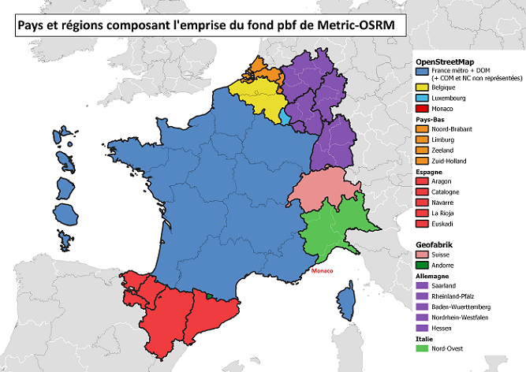

```{r, include = FALSE}
knitr::opts_chunk$set(
  collapse = TRUE,
  comment = "#>")
```

## Finalités du package, public et champ de calcul cibles 

Le package `metric.osrm` a pour vocation de __faciliter l'interrogation d'un serveur de routage de type OSRM__ (Open Source Routing Machine). Il propose :

- Des fonctions de __préparation et conversion des données en entrée__ : transformation de codes communes (codes INSEE ou LAU) ou d'adresses en coordonnées, conversion entre différents formats d'objets (sf, sp ou data.frame) ;

- Des fonctions de __calcul de matrice de temps et de distances__ entre sources et destinations (en face à face, par croisement, aller simple ou aller-retour, __accès au(x) point(s) d'intérêt le(s) plus proche(s)__ dans un rayon de x km, ...) et de __calcul d'isocourbes rapides__ (isochrones, isodistances) ;

- Des fonctions de calcul d'__indicateurs__ associés et la __visualisation__ cartographique de certains résultats.

Le package `metric.osrm` s’adresse principalement aux utlisateurs souhaitant manipuler leurs données en entrée, lancer des calculs potentiellement d’importance et intégrer directement leurs résultats dans un programme plus large d’analyse ou une chaîne de traitement reproductible. Ses fonctions peuvent par ailleurs être ré-utilisées pour le développement d’autres outils.

Développé dans le cadre d'un projet de refonte de l'ancien distancier de référence INSEE (METRIC), il vise principalement à répondre aux besoins spécifiques des chargés d'études de l'institut. Par conséquent, le package `metric.osrm` a exclusivement été testé sur un serveur OSRM disposant d'une configuration et de données routières OpenStreetMap appartenant à un champ géographique précis (voir image ci-dessous) ; un champ précis faisant l'objet de traitements spécifiques dans le code.



## Avant d'utiliser les fonctions

Pour utiliser le package, l'utilisateur devra spécifier, à l'étape 0 de son programme, l'adresse d'un serveur de calcul OSRM et un profil de routage.

```{r}
# On précise l'adresse d'un serveur, ici celle du serveur expérimental déployé
# sur la plateforme du SSPCloud

options(osrm.server = "https://metric-osrm-backend.lab.sspcloud.fr/")

# On précise le profil de routage, ici "driving" (trajet routier en voiture) seul profil
# actuellement disponible sur le serveur déployé sur le SSPCloud 

options(osrm.profile = "driving")
```

## Organisation des fonctions

Les fonctions proposées par le package s'organisent de la sorte :

- Des fonctions pour la __préparation ou la conversion des données__ : `adresseToCoord`, `codeComToCoord`, `codeLauToCoord`, `convertTo`.

- Des fonctions pour __requêter le serveur de calcul__ : `metricOsrmTable`, `metricOsrmRoute`, `metricOsrmIsochrone`.

- Des fonctions pour le __calcul d'indicateurs__ : `statTable`, `indTableSrcDst`, `indIsoSpatial`.

- Des fonctions pour la __visualisation des résultats sur une carte__ : `mapRoutes`, `mapRoutesProp`.

Le résultat de `metricOsrmTable` peut être utilisé pour les fonctions `statTable` et `indTableSrcDst` fournissant respectivement des indicateurs statistiques et des indicateurs en volume.

Le résultat de `metricOsrmRoute` peut être utilisé pour les fonctions `mapRoutes` et `mapRoutesProp` permettant de créer des cartes pour représenter des tracés.

Le résultat de `metricOsrmIsochrone` peut être utilisé pour la fonction `indIsoSpatial` produisant des indicateurs en volume et spatiaux.

## Les articles proposés

Les articles (ou vignettes) proposés dans la documentation expliquent, grâce à des exemples détaillés, comment utiliser à bon escient les différentes fonctionnalités du package.

- L'article __Préparer ses données avec le package {metric.osrm}__ décrit l'utilisation des fonctions `adresseToCoord`, `codeComToCoord`, `codeLauToCoord` et `convertTo`. Ces fonctions vous permettent de convertir vos données en entrée dans un format compatible avec le requêtage du serveur.

- L'article __Calculer une matrice de temps et de distances avec le package {metric.osrm}__ décrit comment utiliser la fonction `metricOsrmTable` pour réaliser des calculs de couples de coordonnées en face à face ou en croisement selon le produit cartésien. L'article détaille également comment produire des indicateurs statistiques à partir de la fonction `statTable`.

- L'article __Calculer l'accès aux équipements les plus proches avec le package {metric.osrm}__ vous montre comment aborder avec le package les problématiques liées à l'accès aux équipements ou autres types de destination. L'article reprend l'utilisation de la fonction `metricOsrmTable` et plus précisément de ses arguments `rayonMax`, `nbDstVolOiseau`, `nbDstMeasure` et `optiMeasure`. Le fonctionnement de la fonction `indTableSrcDst` est également décrit dans cet article.

- L'article __Calculer des isochrones avec le package {metric.osrm}__ détaille l'utilisation de la fonction `metricOsrmIsochrone` pour réaliser des courbes isochrones. Cette fonction peut être utilisée pour calculer l'accessibilité d'un ou plusieurs équipements. Cet article décrit également l'utilisation de la fonction `indIsoSpatial`.

- Enfin, l'article __Visualiser les trajets sur une carte avec le package {metric.osrm}__ précise comment réaliser des cartes leaflet pour représenter des trajets grâce aux fonctions `metricOsrmRoute`, `mapRoutes` et `mapRoutesProp`.

## Les données du package

Pour illustrer les exemples proposés dans les articles, le package `metric.osrm` met à disposition plusieurs tables de données dans des formats différents. Elles sont installées sur votre machine lors de l'installation du package. Pour connaître leur emplacement, exécutez la ligne de code suivante, que vous retrouverez à chaque import de données : `system.file("extdata", package = "metric.osrm")`.

R propose de multiples packages pour importer des données selon leur format. Les fonctions utilisées dans les prochains articles sont :

- `rio::import` pour importer des fichiers .csv et .xls (le package `rio` permet d'importer beaucoup d'autres formats différents) ;

- `readODS::read_ods` pour importer les fichiers .ods ;

- la fonction `readRDS` de base pour charger des tables R. Ces données ont été au préalable sauvegardées depuis R avec la fonction `saveRDS` ;

- `rgdal::readOGR` pour importer des fichiers ShapeFile (.shp) en objets spatiaux de type `sp` (Spatial Data) ;

- `sf::read_sf` pour importer des fichiers ShapeFile (.shp) en objets spatiaux de type `sf` (Simple Features).

Pour être plus précis, un fichier ShapeFile est composé d'au moins 4 fichiers, ne pouvant être séparés :

- un fichier .shp qui défini la géométrie de l'objet spatial ;

- un fichier .dbf qui contient les données attributaires des entités spatiales ;

- un fichier .prj qui défini le système de projection utilisé ;

- un fichier .shx contenant un index pour l'objet spatial.

## Personnalisation des tuiles pour les cartes

Vous pouvez modifier le fond de tuiles utilisé pour les cartes des fonctions `mapRoutes` et `mapRoutesProp`. Il vous faudra spécifier l'adresse URL d'un serveur de tuiles ainsi que ses attributions. Vous trouverez des exemples de fonds de tuiles sur ce [site](https://leaflet-extras.github.io/leaflet-providers/preview/).

Par exemple : 
```{r, eval = FALSE}
options(urlTemplate = "https://{s}.tile.openstreetmap.fr/osmfr/{z}/{x}/{y}.png")
options(attribution = 
          paste0("&copy; <a href='https://www.openstreetmap.org/copyright'>OpenStreetMap</a> 
            contributors"))
```

Pour revenir au fond de tuiles par défaut :
```{r, eval = FALSE}
options(urlTemplate = NULL)
options(attribution = NULL)
```
