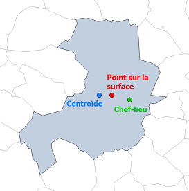
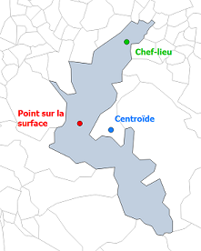

```{r setup, include = FALSE}
knitr::opts_chunk$set(
  collapse = TRUE,
  comment = "#>")
  
library(metric.osrm)
```

Le package `metric.osrm` propose des fonctions permettant de préparer ses données avant de les envoyer sous forme de requêtes au serveur de calcul OSRM.

Les fonctions `adresseToCoord`, `codeComToCoord`, `codeLauToCoord`, `convertTo` vous permettent de convertir vos données brutes en coordonnées lon/lat WGS84 (EPSG 4326).

En entrée, vous pouvez disposer de __coordonnées dans des projections différentes__ (RGF93/Lambert93 - EPSG 2154 par exemple pour la France métropolitaine), sous des __formes différentes__ (data.frame, objets spatiaux sf ou sp) ou de __sources à géolocaliser__ (adresses ou codes communes).

En sortie, ces fonctions retournent des __coordonnées longitude et latitude__ du système géodésique mondial __WGS84__ et ayant pour code EPSG (European Petroleum Survey Group) le __4326__.

## La fonction `adresseToCoord`

Vous disposez d'une liste d'adresses. La fonction `adresseToCoord` permet de géolocaliser des adresses (en France uniquement) en coordonnées lon/lat WGS84.

Pour ce faire, la fonction utilise l'API "Adresse" d'Etalab (documentation : <https://geo.api.gouv.fr/adresse>).

Ci-dessous, quelques exemples d'utilisation de la fonction `adresseToCoord` :

```{r}
adresses <- c("1 Rue des Abeilles 13001 Marseille",
              "1 Allée des Abeilles 13016 Marseille",
              "1 Impasse Abeille 13003 Marseille",
              "1 Impasse de la Chapelle 13013 Marseille",
              "1 Boulevard de la Chapelle 13009 Marseille",
              "1 Boulevard de la Chapelle 13014 Marseille")

adresseToCoord(adresses = adresses,
               nbEchos = 1)

```

En sortie, un data.frame est retourné. Il contient les colonnes ADRESSES, ADRESSES_GEOLOC, LON, LAT et un SCORE entre 0 et 1, indiquant la pertinence de la géolocalisation.

La colonne ADRESSES_GEOLOC correspond aux adresses qui ont été géolocalisées. Une attention toute particulière devra être portée sur cette colonne car les adresses obtenues ne correspondront peut-être pas aux adresses attendues. L'argument `nbEchos` peut être utilisé pour que la fonction retourne plusieurs résultats possibles par adresse fournie. A vous, ensuite, de ne retenir que l'adresse la plus pertinente selon vous. Les échos sont triés par score.

Vous pouvez aussi spécifier les __codes postaux__ ou les __codes Insee__ pour filtrer les résultats selon vos secteurs de recherche.

Les arguments `adresses`, `codePostal` et `codeInsee` doivent être obligatoirement des chaînes de caractères.

Il est à noter également que les noms de lieu ne sont pas pris en compte. Par exemple, "Insee, Dijon" sera géolocalisé à "Rue Dijon 80000 Amiens".

```{r}
adresses <- c("Abeilles Marseille",
              "Chapelle Marseille")

adresseToCoord(adresses = adresses,
               nbEchos = 3)

adresseToCoord(adresses = adresses,
               nbEchos = 3,
               codePostal = c("13001","13009"))

adresseToCoord(adresses = adresses,
               nbEchos = 3,
               codeInsee = c("13201","13209"))

```

Si vous importez votre propre fichier d'adresses, prenez soin de le faire en précisant l'encodage utilisé lors de sa création. Par exemple, spécifiez l'argument `encoding = "UTF-8"` (ou `"Latin-1"`) avec `rio::import` ou `utils::read.csv`. De façon générale, nous conseillons de créer et d'importer le fichier en UTF-8.

## La fonction `codeComToCoord`

Vous disposez d'une liste de __codes communes INSEE__ (et non de codes postaux), la fonction `codeComToCoord` permet de renvoyer les coordonnées lon/lat WGS84 pour chacune d'elle, de leur chef-lieu (chx), de leur centroïde ou d'un point obligatoirement situé sur la surface de la commune.

Le chef-lieu est le point de la commune autour duquel est concentré le maximum de population, le plus souvent autour de la mairie. C'est le résultat par défaut retourné par la fonction (`type = "chx"`).

Le centroïde est le point correspondant au barycentre du polygone formant la commune. Pour obtenir les centroïdes des communes, utilisez l'argument `type = "centroide"`.

Selon la morphologie du contour de la commune, le centroïde peut être situé en dehors des limites communales. Pour éviter cela, il est possible d'utiliser l'argument `type = "pos"` pour point_on_surface (point sur la surface). Il s'agit d'un algorithme qui positionne obligatoirement le point à l'intérieur de la commune. Les chefs-lieux, bien que également tous situés à l'intérieur de leur commune, peuvent en revanche être trop proches des limites communales.

_Exemples avec les communes d'Aix-en-Provence (à gauche) et de Bagnères-de-Bigorre (à droite) :_




L'argument `geo` sert à préciser le millésime du Code Officiel Géographique (COG) de vos codes communes INSEE. Le package permet de renvoyer les coordonnées des chefs-lieux ou centroïdes de plusieurs années du COG, depuis 2017 jusqu'à 2023.

Soyez certain du millésime de la géographie de vos données. La fonction ne renverra que les coordonnées des communes qu'elle reconnaît pour une année donnée. Toutefois, un message dans la console viendra avertir l'utilisateur du nombre de rejet et précisera lesquels.

Pour information, il est possible de récupérer sous forme de table l'ensemble des codes communes Insee d'un millésime donné avec leurs coordonnées (centroïde, pos et chx). Pour ce faire il suffit de taper la commande `metric.osrm:::tablePassage20xx` où xx est le millésime désiré parmi ceux disponibles (note il y a trois : dans la commande).

```{r}
codeComToCoord(codeInsee = c("13001","13002","13003","13004","13005"),
               geo = "2020",
               type = "chx")

codeComToCoord(codeInsee = c("13001","13002","13003","13004","13005"),
               geo = "2020",
               type = "centroide")

codeComToCoord(codeInsee = c("13001","13002","13003","13004","13005"),
               geo = "2020",
               type = "pos")
```

En sortie, la fonction retourne un data.frame de trois colonnes "code", "lon" et "lat".

## La fonction `codeLauToCoord`

La fonction `codeLauToCoord` permet, tout comme `codeComToCoord`, d'obtenir des coordonnées lon/lat WGS84 à partir de codes communes, étrangers cette fois-ci.

Seuls les centroïdes (`type = "centroide"`) et les points sur la surface (`type = "pos"`) sont disponibles. Nous ne disposons pas de chefs-lieux pour les communes étrangères.

Les codes communes étrangers correspondent aux codes LAU (unités administratives locales) dont la liste est disponible sur le [site d'Eurostat](https://ec.europa.eu/eurostat/fr/web/nuts/local-administrative-units).

La géographie des communes LAU est 2020 (dernier millésime Eurostat).

Les communes LAU étrangères du champ metric.osrm sont celles incluses dans le fond PBF ([cf Article - Débuter avec le package {metric.osrm}](http://metric-osrm.pages.innovation.insee.eu/metric-osrm-package/articles/A-Debuter.html)), hors Andorre et Monaco. La liste exhaustive des communes LAU du champ metric.osrm est disponible depuis un fichier csv en exécutant cette commande :

```{r}
# Import de la liste des communes etrangeres du champ metric.osrm.
code_gisco <- rio::import(system.file("extdata",
                                      "listeCodesGISCO.csv",
                                      package = "metric.osrm"))

# Nombre de communes par pays dans le champ metric.osrm.
# Belgique - Suisse - Allemagne - Espagne - Italie - Luxembourg - Pays-Bas
table(substr(code_gisco$codeGISCO,1,2))

# Extrait des 5 premieres lignes du fichier.
rmarkdown::paged_table(code_gisco, options = list(max.print = 5))
```

Le code GISCO correspond à la concaténation du code pays sur 2 caractères et du code LAU de la commune pour assurer l'unicité de l'identifiant. [GISCO](https://ec.europa.eu/eurostat/fr/web/gisco) est le système d'information géographique de la Commission au sein d'Eurostat.

La fonction `codeLauToCoord` ne prend en compte que des codes communes LAU étrangers du champ metric.osrm, hors communes de France, d'Andorre ou Monaco et hors communes au-delà du PBF. Un message d'avertissement viendra prévenir l'utilisateur si de tels codes existent dans les données en entrée.

Pour information, il est possible de récupérer sous forme de table l'ensemble des codes LAU avec leurs coordonnées (centroïde et pos) mais seulement sur le millésime couramment intégré au package. Pour ce faire il suffit de taper la commande `metric.osrm:::tablePassageLAU20xx` où xx est le dernier millésime disponible.

```{r}
# Communes etrangeres :
# Bruxelles (21004), Liège (62063), Luxembourg (0304) et Stuttgard (08111000)
commmunes_etrangeres <- data.frame(CODE_PAYS = c("BE","BE","LU","DE"),
                                   CODE_LAU = c("21004","62063","0304","08111000"),
                                   stringsAsFactors = FALSE)

commmunes_etrangeres

# Renvoie les coordonnees des points sur la surface.
codeLauToCoord(codePays = commmunes_etrangeres$CODE_PAYS,
               codeLau = commmunes_etrangeres$CODE_LAU,
               type = "pos")

# Renvoie les coordonnees des centroides.
codeLauToCoord(codePays = commmunes_etrangeres$CODE_PAYS,
               codeLau = commmunes_etrangeres$CODE_LAU,
               type = "centroide")

# Communes francaises ou hors-champ de metric.osrm.
codeLauToCoord(codePays = c("FR","FR","DE"),
               codeLau = c("57463","67482","11000000"),
               type = "pos")
```

## La fonction `convertTo`

La fonction `convertTo` permet de convertir des données de n'importe quel système de projection vers le système WGS84 (EPSG 4326).

Vous pouvez, à partir d'un data.frame de coordonnées ou d'un objet spatial sf ou sp, transformer cet objet dans un autre type et en WGS84 (EPSG 4326). Toutes les combinaisons de transformation sont possibles entre ces trois types.

Les objets spatiaux sf ou sp peuvent être des points ou des polygones. S'il s'agit de polygones en entrée, les coordonnées de leurs sommets sont retournées si le type en sortie demandé est un data.frame.

En entrée, le data.frame peut être de 2 ou 3 colonnes. Les noms des variables n'ont pas d'importance. Si la table comporte 3 colonnes, la première colonne doit être l'identifiant et les deux autres les coordonnées.

Si l'argument `to` n'est pas spécifié, l'objet en sortie sera du même type que l'objet en entrée.

L'argument `fromEpsg` doit obligatoirement être spécifié si l'objet en entrée est un data.frame.

Par ailleurs, il est aussi possible de convertir des coordonnées vers n'importe quel système de projection autre que le WGS84 (EPSG 4326) grâce à l'argument `toEpsg`. Cependant, le WGS84 (EPSG 4326) est obligatoire pour requêter le serveur de calcul OSRM.

Ci-dessous quelques exemples d'utilisation de la fonction :

__Cas 1 :__ En entrée, un data.frame de 2 colonnes X et Y (Lambert 93). En sortie, un data.frame de coordonnées (WGS84).

```{r}
coord <- data.frame(X = c(897740.5,901367.8,874261.9,897740.5),
                    Y = c(6272912,6251706,6291801,6272912),
                    stringsAsFactors = FALSE)

coord

convertTo(from = coord,
          fromEpsg = 2154)
```

__Cas 2 :__ En entrée, un data.frame de 3 colonnes ID, LON et LAT (WGS84) issu d'un fichier csv. En sortie, un data.frame de coordonnées (Lambert 93). Attention, dans ce cas, les colonnes appelées lon et lat ne correspondent plus à des longitudes et latitudes mais à des coordonnées métriques.

```{r}
coord <- rio::import(file = system.file("extdata",
                                        "convertTo_1.csv",
                                        package = "metric.osrm"))

coord

convertTo(from = coord,
          fromEpsg = 4326,
          toEpsg = 2154)
```

__Cas 3 :__ En entrée, un data.frame de 3 colonnes ID, X et Y (Lambert 93) issu d'un fichier ods. En sortie, un objet sf POINT (WGS84).

```{r}
coord <- rio::import(file = system.file("extdata",
                    "convertTo_2.ods",
                    package = "metric.osrm"))

coord

convertTo(from = coord,
          to = "sf",
          fromEpsg = 2154)
```

__Cas 4 :__ En entrée, un data.frame de 3 colonnes ID, X et Y (Lambert 93) issu d'un fichier xls. En sortie, un objet SpatialPointsDataFrame (WGS84).

```{r}
coord <- rio::import(file = system.file("extdata",
                     "convertTo_3.xls",
                     package = "metric.osrm"))

coord

convertTo(from = coord,
          to = "sp",
          fromEpsg = 2154)
```

__Cas 5 :__ En entrée, un objet sf POLYGON (Lambert 93). En sortie, un data.frame de coordonnées (WGS84), les sommets du polygone.

```{r}
polygon <- matrix(c(897740.5,6272912,901367.8,6251706,874261.9,6291801,897740.5,6272912),
                  ncol = 2,
                  byrow = TRUE)

sf_polygon <- sf::st_sf(ID = 1,
                        geometry = sf::st_sfc(sf::st_geometry(
                                                      sf::st_polygon(list(polygon))),
                                              crs = 2154))

sf_polygon

convertTo(from = sf_polygon,
          to = "data.frame")
```

__Cas 6 :__ En entrée, un objet sf POINT (Lambert 93). En sortie, un data.frame de coordonnées (WGS84).

```{r}
sf_point <- sf::st_sf(ID = 1,
                      geometry = sf::st_sfc(sf::st_geometry(
                                                    sf::st_point(c(897740.5,6272912))),
                                            crs = 2154))

sf_point

convertTo(from = sf_point,
          to = "data.frame")
```

__Cas 7 :__ En entrée, un objet sf POLYGON (Lambert 93) issu d'un shapefile. En sortie, un data.frame de coordonnées (WGS84), les centroïdes du polygone.

```{r}
sf_polygon <- sf::read_sf(dsn = system.file("extdata",
                                            "convertTo_4.shp",
                                            package = "metric.osrm"))

sf_point <- suppressWarnings(sf::st_centroid(sf_polygon))

sf_point

convertTo(from = sf_point,
          to = "data.frame")
```

__Cas 8 :__ En entrée, un objet sf POLYGON (Lambert 93) issu d'un shapefile. En sortie, un objet SpatialPolygonsDataFrame (WGS84).

```{r}
sf_polygon <- sf::read_sf(dsn = system.file("extdata",
                                            "convertTo_4.shp",
                                            package = "metric.osrm"))

sf_polygon

convertTo(from = sf_polygon,
          to = "sp")
```

__Cas 9 :__ En entrée, un objet SpatialPolygonsDataFrame (Lambert 93) issu d'un shapefile. En sortie, un objet sf POLYGON (WGS84).

```{r}
spdf_polygon <- rgdal::readOGR(dsn = system.file("extdata",
                                                 "convertTo_4.shp",
                                                 package = "metric.osrm"))

convertTo(from = spdf_polygon, to = "sf")
```
