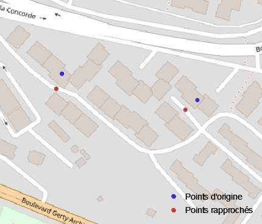
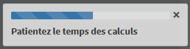

```{r setup, include = FALSE}
knitr::opts_chunk$set(
  collapse = TRUE,
  comment = "#>")

options(osrm.server = "https://metric-osrm-backend.lab.sspcloud.fr/")
options(osrm.profile = "driving")

library(metric.osrm)
```

La fonction `metricOsrmTable` permet de __calculer des temps de trajet et des distances entre plusieurs couples de points__. Elle vous fournira une table où chaque couple, défini par une source et une destination, sera associé à un temps et/ou une distance.

En entrée de la fonction, vous devez disposer d'un __data.frame__ de coordonnées ou d'un __objet spatial sf ou sp__ (points ou polygones). S'il s'agit d'un data.frame, il doit être dans le système géodésique mondial __WGS84__ (EPSG 4326). Les objets spatiaux peuvent être dans n'importe quelle projection ; la fonction les convertira en WGS84 (EPSG 4326). Si les objets spatiaux sont des polygones, les centroïdes seront utilisés pour le calcul.

Les fonctions `adresseToCoord`, `codeComToCoord`, `codeLauToCoord` et `convertTo` vous permettent de transformer vos données brutes (adresses, codes communes, data.frame, objets spatiaux sf ou sp) dans un format accepté par la fonction `metricOsrmTable` _(cf Article : Préparer ses données avec le package {metric.osrm})_.

__Un identifiant par source et par destination est obligatoire.__

```{r}
sources <- data.frame(ID = c("src1","src2"),
                      LON = c(5.44553,5.48212),
                      LAT = c(43.52772,43.33602),
                      stringsAsFactors = FALSE)

destinations <- data.frame(ID = c("dst1","dst2"),
                           LON = c(5.16171,5.44553),
                           LAT = c(43.70377,43.52772),
                           stringsAsFactors = FALSE)

metricOsrmTable(src = sources,
                dst = destinations)
```
La table en sortie est un data.frame composée de 9 colonnes "ID", "idSrc", "lonSrc", "latSrc", "idDst", "lonDst", "latDst", "duree" et "distance". Les durées sont en minutes et les distances en kilomètres. "ID" est l'identifiant du couple (de 1 à n).

Les coordonnées "lonSrc", "latSrc", "lonDst", "latDst" de la table en sortie ne correspondent pas précisément à celles de la table en entrée. Les coordonnées d'origine sont rapprochées sur le noeud le plus proche appartenant au réseau routier. Cette translation de points peut être d'autant plus conséquent dans les zones où le réseau routier est peu dense.



## Arguments `duree` et `distance`

Par défaut, la fonction `metricOsrmTable` prend les arguments `duree` et `distance` à TRUE. Il est possible de spécifier `duree` ou `distance` à FALSE. Cela n'a aucune influence sur les temps de réponse.

```{r}
metricOsrmTable(src = sources,
                dst = destinations,
                duree = TRUE,
                distance = FALSE)
```

## Argument `exclude`

L'argument `exclude` permet d'éviter les autoroutes ("motorway"), les péages ("toll") ou les ferries ("ferry"). Par exemple, si vous souhaitez effectuer les calculs en évitant les autoroutes, vous pouvez spécifier `exclude = "motorway"`. Le serveur OSRM expérimental, déployé sur le SSPCloud, n'accepte qu'une exclusion à la fois.

```{r}
metricOsrmTable(src = sources,
                dst = destinations,
                exclude = "motorway")
```
Dans cet exemple, le 2ème résultat est différent de l'exemple précédent.

## Argument `stable`

L'argument `stable` permet de retourner ou non les stables dans la table de résultats, c'est à dire lorsque les sources sont identiques aux destinations. Par défaut, `stable = FALSE`, les stables sont supprimés de la table de résultats. Si TRUE, les valeurs de durée et de distance sont à 0.

## Arguments `faceAFace` et `allerRetour`

### `faceAFace = TRUE`

Par défaut, l'argument `faceAFace` vaut TRUE, ce qui veut dire que les couples sont constitués ainsi : src1 vers dst1 et scr2 vers dst2.

L'utilisation de `faceAFace = TRUE` peut être utile si vos données en entrée correspondent à des couples déjà constitués. Par exemple, vous disposez d'une table avec des lieux de résidence (COMR) vers des lieux de travail (COMT) :

```{r}
deplacements <- data.frame(COMR = c("13001","13002","13127"),
                           COMT = c("13205","13206","13206"),
                           stringsAsFactors = FALSE)

sources <- codeComToCoord(codeInsee = deplacements$COMR,
                          geo = "2020",
                          type = "chx")

destinations <- codeComToCoord(codeInsee = deplacements$COMT,
                               geo = "2020",
                               type = "chx")

metricOsrmTable(src = sources,
                dst = destinations,
                faceAFace = TRUE)
```

Si le nombre de sources est différent du nombre de destinations, les lignes n'ayant pas de vis à vis seront ignorées. La table sources devrait avoir le même nombre d'observations que la table destinations.

### `faceAFace = FALSE` et `allerRetour = TRUE`

Si vous spécifier `faceAFace = FALSE` et `allerRetour = TRUE`, les couples seront constitués par le produit cartésien de sources et de destination. Ce choix est utile lorsque vous avez une liste de points et que vous voulez connaître les temps d'accès et les distances entre chacun d'eux. Par exemple, vous disposez du fond communal des arrondissements de Marseille. La fonction `metricOsrmTable` calculera les durées et les distances à partir des centroïdes si src et dst sont de polygones.

```{r}
# import du fond des arrondissements de Marseille en objet sf
arm13 <- sf::read_sf(dsn = system.file("extdata",
                                       "armf_dep_13_2020.shp",
                                       package = "metric.osrm"),
                     stringsAsFactors = FALSE)

res <- metricOsrmTable(src = arm13,
                       dst = arm13,
                       faceAFace = FALSE,
                       allerRetour = TRUE)

rmarkdown::paged_table(res)
```

Le tableau contient 16 x 16 - 16 = 240 observations. Les stables ne sont pas retournés.

Le nombre de sources peut être différents du nombre de destinations. Le nombre d'observations de la table en sortie sera (nb src x nb dst - nb stables).

Attention au nombre de sources et de destinations sous peine d'avoir des temps de traitement élevés ! A titre d'exemple, le croisement de 1 000 sources entre elles nécessite le calcul de près d'un million de couples ; un calcul nécessitant une dizaine de minutes de temps de traitement environ selon la qualité du réseau et l'éloignement des points entre les sources et les destinations.

### `faceAFace = FALSE` et `allerRetour = FALSE`

OSRM distingue les trajets allers des trajets retours car les durées et les distances peuvent être différentes. Dans certains cas, il est peut être préférable de ne calculer que les trajets allers.
Si les sources et les destinations contiennent les couples `src_Pau` vers `dst_Agen` et `src_Agen` vers `dst_Pau`, alors si `allerRetour = FALSE`, seul le couple `src_Pau` vers `dst_Agen` sera retourné (`src_Agen` vers `dst_Pau` ne sera pas calculé).
Ce choix peut être judicieux si vous avez un grand nombre de sources et de destinations identiques afin de gagner en temps de traitement, comme par exemple pour le calcul des temps de trajet entre toutes les communes d'une même région.

```{r}
res <- metricOsrmTable(src = arm13,
                       dst = arm13,
                       faceAFace = FALSE,
                       allerRetour = FALSE)

rmarkdown::paged_table(res)
```
Pour des sources et des destinations identiques, deux fois moins de couples sont calculés avec `allerRetour = FALSE`.

Dans tous les cas, avant de vous lancer tête baissée dans le requêtage OSRM, réfléchissez bien aux couples que vous voulez calculer. Sont-ils pertinents pour l'étude que je réalise ? Pour aller plus loin, l'article _"Calculer l'accès aux équipements les plus proches avec le package {metric.osrm}"_ vous aidera notamment à filtrer les résultats selon d'autres critères.

Enfin, n'oubliez pas si vous le souhaitez, de sauvegarder le résultat dans un format de votre choix : en base R (RDS ou RData), en fichier csv, dbf, etc...

### Calculs d'indicateurs

La fonction `statTable` permet de calculer des indicateurs statistiques sur les résultats de la fonction `metricOsrmTable`. Elle renvoie le nombre de couples calculés, le nombre de sources distinctes, le nombre de destinations distinctes et, pour la durée et la distance, les valeurs min et max, la moyenne et la médiane.

```{r}
resultats <- metricOsrmTable(src = arm13,
                             dst = arm13,
                             faceAFace = FALSE,
                             allerRetour = TRUE)

statTable(resultats)
```
Le résultat est sous forme de liste.

Avec l'argument `allerRetour = FALSE` :

```{r}
resultats <- metricOsrmTable(src = arm13,
                             dst = arm13,
                             faceAFace = FALSE,
                             allerRetour = FALSE)

statTable(resultats)
```
Ou encore avec l'argument `stable = TRUE`

```{r}
resultats <- metricOsrmTable(src = arm13,
                             dst = arm13,
                             faceAFace = FALSE,
                             allerRetour = TRUE,
                             stable = TRUE)

statTable(resultats)
```

Aussi, il est possible que des couples ne puissent pas être calculés, par exemple entre un DOM et la métropole. Dans ce cas, la fonction metricOsrmTable retournera des valeurs -999999.00 pour la durée et la distance. Des messages d'avertissement viendront prévenir l'utilisateur si il existe de tels couples. Ces derniers seront supprimés automatiquement de la table si la fonction `statTable` est exécutée.

## Argument `interactive`

Cet argument, par défaut à FALSE, peut être mis à TRUE si vous utilisez les fonctions du package `metric.osrm` dans une application R-Shiny.

Lorsque les traitements sont longs, un barre de progression vous indique le pourcentage de calculs réalisés. Cette barre est différente selon le contexte.

Dans un contexte classique (`interactive = FALSE`), affichage dans la console :
```{r, eval = FALSE}
Calcul en cours - 1/3 : [==================] 100%  124s
Calcul en cours - 2/3 : [==================] 100%  452s
Calcul en cours - 3/3 : [=========         ] 50%  56s
```

Dans un contexte R-Shiny (`interactive = TRUE`), affichage en bas à droite de l'application :



## Arguments `rayonMax`, `nbDstVolOiseau`, `nbDstMeasure`, `optiMeasure` et `emprise`

L'article _"Calculer l'accès aux équipements les plus proches avec le package {metric.osrm}"_ traite l'utilisation de ces arguments.
