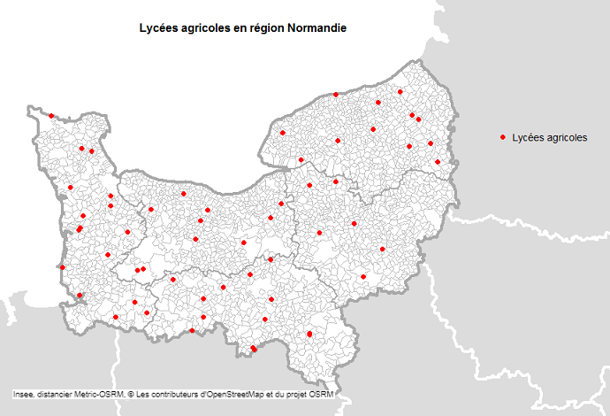
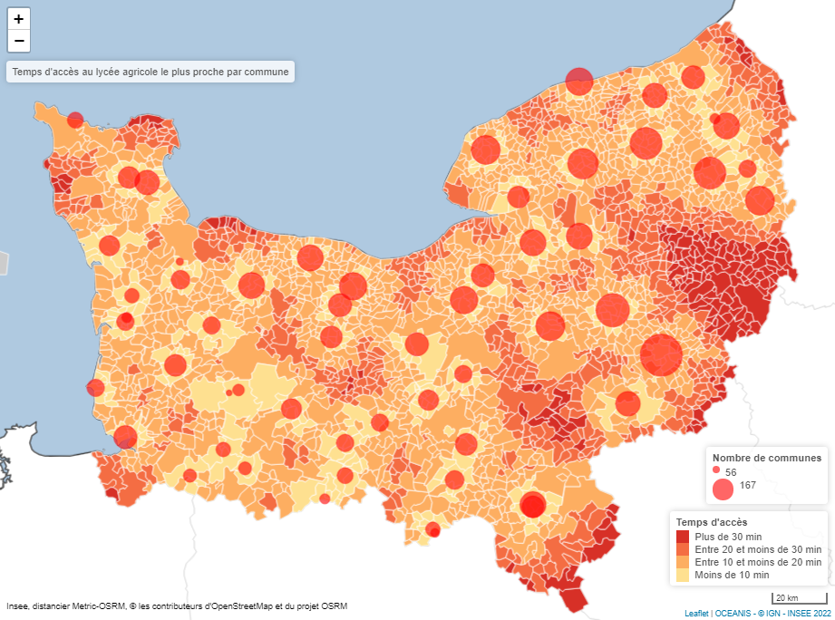
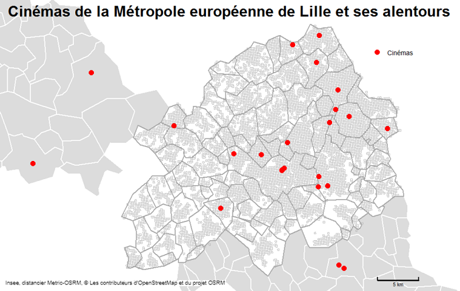
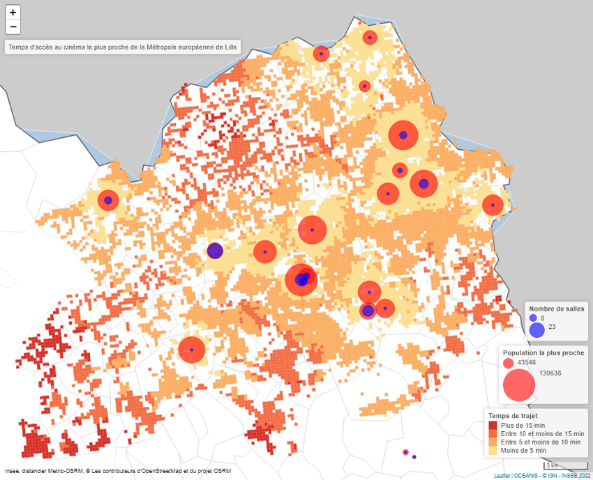

```{r, include = FALSE}
knitr::opts_chunk$set(
  collapse = TRUE,
  comment = "#>")

options(osrm.server = "https://metric-osrm-backend.lab.sspcloud.fr/")
options(osrm.profile = "driving")

library(metric.osrm)
library(sf)
library(oceanis)
library(dplyr)
library(leaflet)
```

Cet article est un prolongement de la vignette _Calculer une matrice de temps et de distances avec le package {metric.osrm}_. Il illustre, dans le cadre d'un calcul d'accessibilité, comment paramétrer la fonction `metricOsrmTable` afin d'éviter les requêtes inutiles et ainsi réduire les temps de traitement.

Pour ce faire, nous suivrons deux exemples fictifs d'étude :

- La 1ère étude consiste à calculer l'accessibilité des lycées agricoles pour chaque commune de Normandie.

- La 2ème étude consiste à calculer l'accessibilité des cinémas par la population (carroyée) de la Métropole européenne de Lille.

## 1er exemple : Étudier l'accessibilité des lycées agricoles par commune en Normandie

__Pour chaque commune de la région Normandie, on calcule le temps d'accès et la distance au lycée agricole le plus proche en temps situé dans un rayon maximal de 60 km à vol d'oiseau.__

Pour réaliser cette étude, on dispose de la base communale de Normandie, soit 2 652 communes en 2020. Nous disposons également, pour cette région, de la liste des lycées agricoles géolocalisés par leur coordonnées X et Y en projection Lambert93, issue de la [Base Permanente des Équipements (BPE)](https://www.insee.fr/fr/statistiques/3568656), soit 57 lycées agricoles en 2018 _(voir carte ci-dessous)_.

```{r}
# import des fonds de carte ShapeFile (.shp) en objet sf

# import du fond des communes de Normandie
com_reg_normandie <- sf::read_sf(dsn = system.file("extdata",
                                                   "com_reg_normandie.shp",
                                                   package = "metric.osrm"),
                                 stringsAsFactors = FALSE)

# import de la liste des lycées agricoles de Normandie issues de la BPE2018
# (REG = "28" et TYPEQU = "C303")
bpe2018_lyc_agr_reg28 <- readRDS(system.file("extdata",
                                 "bpe2018_lyc_agr_reg28.RDS",
                                 package = "metric.osrm"))

# transformation des variables coordonnées en numérique
bpe2018_lyc_agr_reg28$LAMBERT_X <- as.numeric(bpe2018_lyc_agr_reg28$LAMBERT_X)
bpe2018_lyc_agr_reg28$LAMBERT_Y <- as.numeric(bpe2018_lyc_agr_reg28$LAMBERT_Y)

# création d'un identifiant unique pour les équipements.
bpe2018_lyc_agr_reg28$ID <- 1:nrow(bpe2018_lyc_agr_reg28)

# conversion des coordonnées en WGS84 (EPSG 4326)
sf_lycees_agricoles <- convertTo(from = bpe2018_lyc_agr_reg28[,c("ID",
                                                                 "LAMBERT_X",
                                                                 "LAMBERT_Y")],
                                 to = "sf",
                                 fromEpsg = 2154,
                                 toEpsg = 4326)
```



Pour rappel, il existe dans la BPE trois gammes d'équipements : supérieure, intermédiaire et de proximité. Les lycées agricoles (code C303) sont classés dans la gamme supérieure, particulièrement pertinente pour une analyse au niveau régional.

Nous disposons des codes communes de Normandie issus du fond communal. Nous voulons réaliser les calculs à partir des chefs-lieux des communes et non de leurs centroïdes _(cf Article : Préparer ses données avec le package {metric.osrm})_. Nous utiliserons donc la fonction `codeComToCoord` avec l'argument `type = "chx`, le choix par défaut (en spécifiant l'argument `type = "centroide"` ou `type = "pos"`, les centroïdes des communes ou le point sur la surface nous seraient retournés).

```{r}
chx_com_reg_normandie <- codeComToCoord(codeInsee = com_reg_normandie$code,
                                        geo = "2020",
                                        type = "chx")

rmarkdown::paged_table(chx_com_reg_normandie)
```

Nous sommes prêts à utiliser la fonction `metricOsrmTable`. Il est ainsi possible de réaliser les calculs entre toutes les communes et tous les lycées agricoles ; il y aurait alors 2652*57 soit 151 164 résultats et autant de requêtes au serveur. Toutefois, nombre de ces résultats nous sont peut être inutiles. En effet, dans une problématique d'accessibilté, nul besoin le plus souvent de connaître distance et temps de parcours vers TOUS les équipements ; le ou les plus proches étant plus pertinent. De même, une distance et donc un temps de trajet trop importants peuvent inhiber toute velléité de déplacement.

Les arguments `rayonMax`, `nbDstVolOiseau`, `nbDstMeasure` et `optiMeasure` de la fonction `metricOsrmTable` vont nous permettre de filtrer les calculs et résultats pour ne conserver que les couples correspondant aux critères pertinents de l'étude.

### L'argument `rayonMax`

L'argument `rayonMax` permet de sélectionner toutes les sources situées à moins de x kilomètres d'une destination à vol d'oiseau. Pour notre étude fictive, choisissons 60 km. Cela revient à tracer un cercle de 60 km de rayon autour de chaque chef lieu de commune et ne garder, pour les calculs, que les lycées situés dans ce cercle.

Par défaut `rayonMax` vaut 0 : il n'y a pas de filtre sur la distance.

Il est tout à fait possible que certains résultats affichent une distance par la route supérieure au filtre `rayonMax`. Logique, le trajet par la route est toujours plus long que celui à vol d'oiseau.

Nous spécifierons `rayonMax = 60`.

### L'argument `nbDstVolOiseau`

L'argument `nbDstVolOiseau` permet de limiter le nombre de destinations par source. Si `rayonMax` vaut 0, on retiendra n destinations au maximum, les plus proches à vol d'oiseau pour chaque source.

Il est possible de cumuler les conditions `rayonMax` et `nbDstVolOiseau`. Pour notre étude, nous cherchons au final uniquement à savoir quel est pour chaque commune le lycée agricole (dans un rayon de 60 km à vol d'oiseau) le plus proche en temps d'accès par la route. Réseau de transport oblige, le lycée le plus proche à vol d'oiseau ne l'est peut être pas en temps de trajet. Nous élargirons donc notre recherche aux 3 lycées les plus proches à vol d'oiseau dans ce rayon de 60 km.

Les calculs se feront ainsi uniquement :

  - depuis les chefs-lieux de communes disposant d'au moins un lycée agricole à moins de 60 km à vol d'oiseau ;
  
  - vers les 3 lycées agricoles les plus proches.

Par défaut `nbDstVolOiseau` vaut 0 : il n'y a pas de filtre sur le nombre de destinations les plus proches à vol d'oiseau.

Nous spécifierons `nbDstVolOiseau = 3`.

Lorsque les arguments `rayonMax` ou `nbDstVolOiseau` sont supérieures à 0, les identifiants de sources (src) et de destinations (dst) doivent être obligatoirement uniques. Nous avons déjà créé un identifiant unique pour les équipements.

### Les arguments `nbDstMeasure` et `optiMeasure`

Les arguments `nbDstMeasure` et `optiMeasure` ne diminuent pas le nombre de requêtes ni le temps de traitement de la fonction `metricOsrmTable`. Ils permettent uniquement d'en filtrer a posteriori rapidement les résultats.

L'argument `nbDstMeasure` permet de retenir n destinations les plus proches en temps de trajet ou en distance.

L'argument `optiMeasure` permet de choisir le type d'optimisation entre le temps de trajet ou la distance, mais les deux seront bien retournés si les arguments `duree` et `distance` valent TRUE.

Pour notre étude, nous voulons un seul lycée agricole, le plus proche en temps de trajet par commune. Or nous avions précédemment calculé les couples entre chaque commune et les 3 lycées les plus proches à moins de 60 km à vol d'oiseau. Dans la fonction, nous spécifierons donc `nbDstMeasure = 1` et `optiMeasure = "duree"` (ou "distance" si nous voulions le lycée simplement le plus proche en km par la route).

Par défaut `nbDstMeasure = 0` : il n'y a pas de filtre sur le nombre de destinations les plus proches en temps de trajet ou en distance.

Si `nbDstMeasure = n` (n>1), il pourra avoir jusqu'à n destinations par source dans la table de résultats.

### L'argument `emprise`

Si l'argument `rayonMax` > 0, alors il faut préciser l'emprise. Il s'agit de la zone géographique contenant les coordonnées des sources et des destinations. Les valeurs possibles pour l'emprise sont : "FRM" (par défaut) pour la France métropolitaine et ses régions transfrontalières, "971" pour la Guadeloupe, "972" pour la Martinique, "973" pour la Guyane, "974" pour la Réunion, "976" pour Mayotte ou "999" pour une autre zone.

L'emprise déclarée permet de déterminer le système de coordonnées projetées adapté à la zone géographique. En effet, pour limiter les déformations obligatoires dues à la projection des points d'un ellipsoïde vers un plan, il faut choisir une projection adaptée. Celles en vigueur pour la France métropolitaine et les DOM sont :

- France métropolitaine : Lambert 93 - EPSG 2154

- Guadeloupe : UTM 20 N - EPSG 5490

- Martinique : UTM 20 N - EPSG 5490

- Guyane : UTM 22 N - EPSG 2972

- La Réunion : UTM 40 S - EPSG 2975

- Mayotte : UTM 38 S - EPSG 4471

Si les coordonnées ne sont proches d'aucune de ces zones, il faut alors préciser `emprise = "999"`. Le système de coordonnées projeté retenu sera alors le système Mercator (EPSG 3395). Ce système, adapté pour le monde entier, induit des déformations de territoires sur la carte, d'autant plus importantes en s'éloignant de l'équateur.

Le calcul de distances à vol d'oiseau est réalisé à partir de coordonnées projetées alors que le calcul de distances par OSRM est réalisé directement à partir de l'ellipsoïde (WGS84). Pour que la comparaison de ces deux distances soit la meilleure possible, il faut choisir un système de projection adapté à la zone. Malgré tout, il est possible, bien que contre-intuitif, que deux points, situés l'un et l'autre à moins de 40 km par la route (calcul OSRM), soient distants de plus de 40 km à vol d'oiseau (calcul sur des coordonnées projetées : le trajet est déformé). Dans ce cas, le filtre `rayonMax` sera trop restrictif.

### Les arguments `faceAFace` et `stable`

Pour les problématiques d'accès aux équipements, les sources et les destinations n'étant pas de même nature, il n'est pas possible de calculer en face à face. Il faut donc bien spécifier `faceAFace = FALSE`.

Pour la même raison, il faut spécifier également `stable = TRUE` car certaines sources peuvent potentiellement se situer au même endroit que les destinations (mêmes coordonnées rapprochées sur le réseau routier).

Finalement, nous obtenons la fonction `metricOsrmTable` suivante :

```{r}
res <- metricOsrmTable(src = chx_com_reg_normandie,
                       dst = sf_lycees_agricoles,
                       faceAFace = FALSE,
                       stable = TRUE,
                       rayonMax = 60,
                       nbDstVolOiseau = 3,
                       nbDstMeasure = 1,
                       optiMeasure = "duree",
                       emprise = "FRM")

rmarkdown::paged_table(res)
```
Le calcul dure moins d'une minute pour 7 819 couples. Sans filtres a priori (`rayonMax = 0` et `nbDstVolOiseau = 0`), le calcul aurait duré plus de 10 minutes pour 151 164 couples.

Le tableau final ne renverra que 2 652 couples car nous avons demandé à la fonction de sélectionner, après calculs, un seul lycée agricole, le plus proche en temps de trajet (`nbDstMeasure = 1`).

Au moyen de ce tableau final de résultats, nous pouvons par exemple calculer quelques indicateurs en volume et réaliser une carte.

### La fonction `indTableSrcDst`

La fonction `indTableSrcDst` permet de calculer des indicateurs en volume par source et par destination.

Elle prend comme unique argument le tableau de résultats de la fonction `metricOsrmTable`. L'ordre des colonnes doit être obligatoirement conservé.

Pour notre étude, notre tableau de résultats nous permet via la fonction `indTableSrcDst` de connaître immédiatement le nombre de communes les plus proches de chaque lycée agricole. En ajoutant d'autres variables en volume à ce tableau de résultats, nous pourrions calculer d'autres indicateurs tel que la population communale desservie par chaque lycée. Cette possibilité d'ajout sera abordée dans la deuxième étude fictive.

La fonction `indTableSrcDst` retourne une liste de deux objets sf (avec géométrie) :

- le premier objet sf contient une source par observation. Pour chaque variable en volume, il est calculé la part de ce volume dans l'ensemble des sources par destination. Dans cet exemple, il n'y a pas de variable en volume à ajouter ; cet objet ne sera donc pas exploité. La 2ème étude le fera _(voir plus bas)_.

- le deuxième objet sf contient une destination par observation. La somme de toutes les variables en volume est calculée pour chaque destination. Dans cet exemple, le nombre total de sources (communes) par destination (lycée agricole) sera calculé.

```{r}
ind_res <- indTableSrcDst(res)

rmarkdown::paged_table(ind_res[[2]])
```

Nous avons ainsi, pour chaque lycée agricole, le nombre de communes les plus proches.

### Cartographie

Réalisons maintenant une cartographie rapide du résultat à l'aide des packages oceanis et leaflet. La carte d'analyse représentera à la fois une analyse en classes (discrétisation) des temps d'accès par commune au lycée agricole le plus proche et, via des ronds proportionnels, le nombre de communes desservies par chacun de ces lycées.

En exécutant le code ci-dessous, vous aurez une carte dynamique, zoomable et cliquable. Mais pour des raisons de rendu, nous vous proposons ici qu'une capture d'écran figée de la carte dynamique.

```{r, eval = FALSE}
# import du fond régional France métro
reg_france_metro <- sf::read_sf(dsn = system.file("extdata",
                                                  "reg_france_metro.shp",
                                                  package = "metric.osrm"),
                                stringsAsFactors = FALSE)

map <- # création de la carte avec l'analyse en classes
       oceanis::leaflet_classes(data = res,
                                fondMaille = com_reg_normandie,
                                fondSuppl = com_reg_normandie,
                                idData = "idSrc",
                                varRatio = "duree",
                                bornes = c(10,20,30)) %>%
  
       # préparation d'une couche au-dessus de la carte.
       leaflet::addMapPane(name = "fond_reg",
                           zIndex = 404) %>%

       # ajout du fond régional
       leaflet::addPolygons(data = reg_france_metro,
                            stroke = TRUE,
                            color = "#BFBFBF",
                            opacity = 1,
                            weight = 0.5,
                            options = leaflet::pathOptions(pane = "fond_reg",
                                                           clickable = T),
                            popup = reg_france_metro$libelle,
                            fill = T,
                            fillColor = "white") %>%
  
       # ajout légende des classes
       leaflet::addLegend(position = "bottomright",
                          colors = rev(oceanis::recup_palette(stylePalette = "defaut",
                                                              nbNeg = 0,
                                                              nbPos = 4)[[1]]),
                          opacity = 1,
                          labels = c("Plus de 30 min",
                                     "Entre 20 et moins de 30 min",
                                     "Entre 10 et moins de 20 min",
                                     "Moins de 10 min"),
                          title = "Temps d'accès") %>% 
  
       # préparation d'une couche au-dessus de la carte
       leaflet::addMapPane(name = "fond_equ",
                           zIndex = 410) %>%

       # ajout des cercles pour le nombre de communes par lycée agricole
       leaflet::addCircleMarkers(data = ind_res[[2]],
                                 # calcul des rayons
                                 radius = sqrt(ind_res[[2]]$nbSrc/pi)*4,
                                 weight = 1,
                                 color = "red",
                                 opacity = 0.6,
                                 fillColor = "red",
                                 fillOpacity = 0.6,
                                 popup = paste0("Lycée agricole
                                                le plus proche<br>pour ",
                                                ind_res[[2]]$nbSrc, " communes"),
                                 options = leaflet::pathOptions(pane = "fond_equ",
                                                                clickable = T)) %>%
  
       # ajout de la légende des ronds pour le nombre de communes par lycée agricole
       leaflet::addLegend(position = "bottomright",
                          colors = paste0(rep("red",2), "; border-radius: 50%; width:",
                                          c(sqrt(max(ind_res[[2]]$nbSrc)/pi)*(4/3),
                                            sqrt(max(ind_res[[2]]$nbSrc)/pi)*4),
                                          "px; height:",
                                          c(sqrt(max(ind_res[[2]]$nbSrc)/pi)*(4/3),
                                            sqrt(max(ind_res[[2]]$nbSrc)/pi)*4),
                                          "px"),
                          opacity = 0.6,
                          labels = c(round(max(ind_res[[2]]$nbSrc, na.rm = TRUE)/3,0),
                                     round(max(ind_res[[2]]$nbSrc, na.rm = TRUE),0)),
                          title = "Nombre de communes") %>%
  
       # ajout d'un titre
       leaflet::addControl(html = paste0("Temps d'accès au lycée agricole
                                         le plus proche par commune"),
                           position = "topleft") %>%
  
       # ajout d'une source
       leaflet::addControl(html = paste0("Insee, distancier Metric-OSRM, © les contributeurs d'OpenStreetMap et du projet OSRM"),
                           position = "bottomleft",
                           className = tags$style(HTML(".leaflet-control.map-sourc {}")))

map
```



Pensez à sauvegarder vos résultats si vous le souhaitez. Il existe de nombreux formats différents, pour ne citer que les plus courants : base R (.RDS ou .Rdata), fichier .csv, .dbf, .ods, .xls ou encore .shp (shapefile) pour les fonds de carte.

## 2ème exemple : étude sur l'accessibilité des cinémas dans la Métropole européenne de Lille

__Calculer les temps d'accès au cinéma le plus proche par la population de la Métropole européenne de Lille.__

Pour réaliser cette étude, nous avons d'abord besoin d'une grille carroyée fine de la Métropole européenne de Lille ; une grille dotée si possible d'une donnée de population par carreau. Nous optons pour celle à 200m du dispositif [Filosofi 2015](https://www.insee.fr/fr/statistiques/4176290?sommaire=4176305), disponible sur insee.fr. Pour information, une grille avec des carreaux de 1 km est également [disponible](https://www.insee.fr/fr/statistiques/4176293?sommaire=4176305)

N'étant intéressés que par la métropole de Lille, nous ne retiendrons que les carreaux habités appartenant à ses [90 communes](https://www.insee.fr/fr/metadonnees/cog/intercommunalite-metropole/EPCI245900410-metropole-europeenne-de-lille).

La grille ainsi filtrée comporte au final 8 952 carreaux peuplés de 200 mètres de côté. Ces carreaux constitueront les sources de nos trajets, les points de départ si vous préférez.

Nous avons également besoin d'une liste de cinémas et de leurs coordonnées X et Y en projection Lambert93. Pour ce faire, nous utiliserons la [Base Permanente des Équipements (BPE) 2018 des sports et loisirs](https://www.insee.fr/fr/statistiques/3568656). Il y a 119 cinémas en région Hauts-de-France. Nous intégrons volontairement des cinémas en dehors de la métropole parce que les déplacements ne s'arrêtent pas à des frontières administratives _(voir carte ci-dessous)_. Ce seront les destinations de nos trajets.

```{r}
# import de la grille carroyée Filosofi pré-filtrée sur les 90 communes
# de la Métropole Européenne de Lille
carr_com_metro_lille <- readRDS(system.file("extdata",
                                "carr_com_metro_lille.RDS",
                                package = "metric.osrm"))

# import de la liste des cinémas de Hauts-de-France issue de la BPE2018
# (REG = "32" et TYPEQU = "F303")
bpe2018_cinemas_reg32 <- readRDS(system.file("extdata",
                                 "bpe2018_cinemas_reg32.RDS",
                                 package = "metric.osrm"))

dt_cinemas <- bpe2018_cinemas_reg32[,c("DEPCOM","LAMBERT_X","LAMBERT_Y","NB_SALLES")]

# création d'un identifiant unique
dt_cinemas$ID <- 1:nrow(dt_cinemas)
```



Le fond carroyé importé dans notre exemple est déjà un objet sf. Il est donc inutile de le transformer avec la fonction `convertTo`, pourvu que son système de projection, peu importe lequel, soit valide. Pour vérifier la validité d'un système de projection :

```{r}
!is.na(sf::st_crs(carr_com_metro_lille))
```

Le fond possède un CRS valide.

Notre fichier de destinations (les cinémas) est un data.frame de coordonnées dans le système de projection Lambert93 (EPSG 2154). Il est nécessaire de transformer au préalable ces coordonnées dans le système de projection WGS84 (EPSG 4326).

```{r}
# La fonction convertTo n'accepte que 2 ou 3 colonnes
dt_cinemas_WGS84 <- convertTo(from = dt_cinemas[,c("ID","LAMBERT_X","LAMBERT_Y")],
                              fromEpsg = 2154)

# On recolle la variable NB_SALLES à la table dt_cinemas
dt_cinemas <- merge(dt_cinemas_WGS84,
                    dt_cinemas[,c("ID","NB_SALLES")],
                    by.x = "id",
                    by.y = "ID")

rm(dt_cinemas_WGS84)

rmarkdown::paged_table(dt_cinemas)
```

### Envoi des requêtes au serveur OSRM

Nous disposons maintenant de toutes les données nécessaires pour le requêtage vers le serveur OSRM avec la fonction `metricOsrmTable`.

Pour éviter l'envoi de 8952*119 soit 1 065 288 couples, nous allons filtrer les couples en amont du requêtage. Pour cela, nous allons rechercher les cinémas à moins de 25 km de chaque carreau. Au-delà, on estime arbitrairement que le déplacement n'a pas de sens ou que le cinéma est trop éloigné de la zone d'étude. Nous spécifions donc `rayonMax = 25`.

Parmi eux, nous conservons les 3 plus proches à vol d'oiseau : `nbDstVolOiseau = 3`.

Enfin, nous ne souhaitons garder, après requêtage, que le cinéma le plus proche en temps de trajet. Nous utilisons les arguments `nbDstMeasure = 1` et `optiMeasure = "duree"`.

```{r}
res <- metricOsrmTable(src = carr_com_metro_lille,
                       dst = dt_cinemas[,c("id","lon","lat")],
                       faceAFace = FALSE,
                       stable = TRUE,
                       rayonMax = 25,
                       nbDstVolOiseau = 3,
                       nbDstMeasure = 1,
                       optiMeasure = "duree",
                       emprise = "FRM")

rmarkdown::paged_table(res)
```

Le calcul a duré moins de 3 minutes. Le tableau de résultats comprend 8 952 observations, soit autant que de carreaux de ma grille carroyée. Cela signifie donc que tous les carreaux de la métropole sont à moins de 25km d'un cinéma.

### Calcul des indicateurs en volume

Utilisons la fonction `indTableSrcDst` pour calculer la population la plus proche de chaque cinéma. Au préalable, il est nécessaire d'ajouter la population carroyée au tableau de sortie de la fonction `metricOsrmTable`. La variable de population carroyée dans la grille Filsosofi est nommée `Ind`; je la rajoute à mon tableau avec comme clef de fusion l'identifiant des carreaux (idSrc dans le tableau de résultats, IdINSPIRE dans la grille Filosofi).

```{r}
res <- merge(res,
             as.data.frame(carr_com_metro_lille)[,c("IdINSPIRE","Ind")],
             by.x = "idSrc",
             by.y = "IdINSPIRE")

ind_res <- indTableSrcDst(res)

rmarkdown::paged_table(ind_res[[2]])
```
Grâce à la présence de la variable en volume `Ind`, le 1er objet sf de la liste `ind_res` donne la part de la population (en pourcentage) par carreau dans l'ensemble de la population des carreaux vers le cinéma le plus proche. Par exemple, dans `ind_res[[2]]`, pour le `idDst = "18"`, il y a 622 carreaux concernés regroupant 46 361 individus. Dans `ind_res[[1]]`, le carreau ayant pour identifiant `idSrc = "CRS3035RES200mN3079200E3836600"` fait parti des 622 carreaux (`idDst = "18"`). La part de la population de ce carreau est de 708 / 46361 * 100 = 1.527 %.

### Cartographie

Cartographions rapidement ces résultats avec oceanis et leaflet (la carte proposée est une capture d'écran de la carte dynamique). On superpose une analyse en classes des temps d'accès par carreau vers le cinéma le plus proche et des ronds proportionnels nous indiquant la population desservie par ces derniers. Par zèle (il s'agit d'une carte d'analyse après tout), ajoutons également le nombre de salles de chacun de ces cinémas.

```{r, eval = FALSE}
# import du fond des communes du département 59
com_dep59 <- sf::read_sf(dsn = system.file("extdata",
                                           "com_dep59.shp",
                                           package = "metric.osrm"),
                         stringsAsFactors = FALSE)

# transformation du fond communal en projection WGS84 (EPSG 4326)
com_dep59 <- sf::st_transform(com_dep59,
                              crs = 4326)

# on ne garde que les cinémas impactant l'étude
dt_cinemas <- dt_cinemas[dt_cinemas$id %in% ind_res[[2]]$idDst,]

# on supprime le couple non calculé
res <- res[!res$duree %in% -999999.00,]

map <- # création de la carte avec l'analyse en classes
       oceanis::leaflet_classes(data = res,
                                fondMaille = carr_com_metro_lille,
                                fondSuppl = carr_com_metro_lille,
                                idData = "idSrc",
                                varRatio = "duree",
                                bornes = c(5,10,15),
                                colBorder = "transparent") %>%
  
       # modification des popup des carreaux
       oceanis::set_pop_up(popup = paste0("Temps de trajet : ", res$duree,
                                          " minutes")) %>%
        
       # ajout légende des classes
       leaflet::addLegend(position = "bottomright",
                          colors = rev(oceanis::recup_palette(stylePalette = "defaut",
                                                              nbNeg = 0,
                                                              nbPos = 4)[[1]]),
                          opacity = 1,
                          labels = c("Plus de 15 min",
                                     "Entre 10 et moins de 15 min",
                                     "Entre 5 et moins de 10 min",
                                     "Moins de 5 min"),
                          title = "Temps de trajet") %>% 
  
       # préparation d'une couche au-dessus de la carte
       leaflet::addMapPane(name = "fond_com",
                           zIndex = 404) %>%

       # ajout du fond communal
       leaflet::addPolygons(data = com_dep59,
                            stroke = TRUE,
                            color = "#BFBFBF",
                            opacity = 1,
                            weight = 0.5,
                            options = leaflet::pathOptions(pane = "fond_com",
                                                           clickable = T),
                            popup = com_dep59$libelle,
                            fill = T,
                            fillColor = "white") %>%

       # préparation d'une couche au-dessus de la carte
       leaflet::addMapPane(name = "fond_cinema_pop",
                           zIndex = 411) %>%

       # ajout des cercles pour la population
       leaflet::addCircleMarkers(data = ind_res[[2]],
                                  # calcul des rayons
                                 radius = sqrt(ind_res[[2]]$Ind/pi)/6,
                                 weight = 1,
                                 color = "red",
                                 opacity = 0.6,
                                 fillColor = "red",
                                 fillOpacity = 0.6,
                                 popup = paste0("Cinéma le plus proche<br>pour ",
                                                ind_res[[2]]$Ind, " individus"),
                                 options = leaflet::pathOptions(pane = "fond_cinema_pop",
                                                                clickable = T)) %>%
  
       # ajout de la légende des ronds pour la population
       leaflet::addLegend(position = "bottomright",
                          colors = paste0(rep("red",2), "; border-radius: 50%; width:",
                                          c(sqrt(max(ind_res[[2]]$Ind)/pi)/9,
                                            sqrt(max(ind_res[[2]]$Ind)/pi)/3),
                                          "px; height:",
                                          c(sqrt(max(ind_res[[2]]$Ind)/pi)/9,
                                            sqrt(max(ind_res[[2]]$Ind)/pi)/3),
                                          "px"),
                          opacity = 0.6,
                          labels = c(round(max(ind_res[[2]]$Ind, na.rm = TRUE)/3,0),
                                     round(max(ind_res[[2]]$Ind, na.rm = TRUE),0)),
                          title = "Population la plus proche") %>% 
  
       # préparation d'une couche au-dessus de la carte
       leaflet::addMapPane(name = "fond_cinema_salles",
                           zIndex = 412) %>%

       # ajout des cercles pour le nombre de salles
       leaflet::addCircleMarkers(data = ind_res[[2]],
                                 radius = sqrt(dt_cinemas$NB_SALLES/pi)*6,
                                 weight = 1,
                                 color = "blue",
                                 opacity = 0.6,
                                 fillColor = "blue",
                                 fillOpacity = 0.6,
                                 popup = paste0("Nombre de salles : ",
                                                dt_cinemas$NB_SALLES),
                                 options = leaflet::pathOptions(
                                                            pane = "fond_cinema_salles",
                                                            clickable = T)) %>%

       # ajout de la légende des ronds pour le nombre de salles
       leaflet::addLegend(position = "bottomright",
                          colors = paste0(rep("blue",2), "; border-radius: 50%; width:",
                                          c(sqrt(max(dt_cinemas$NB_SALLES)/pi)*6,
                                            sqrt(max(dt_cinemas$NB_SALLES)/pi)*12),
                                          "px; height:",
                                          c(sqrt(max(dt_cinemas$NB_SALLES)/pi)*6,
                                            sqrt(max(dt_cinemas$NB_SALLES)/pi)*12),
                                          "px"),
                          opacity = 0.6,
                          labels = c(round(max(dt_cinemas$NB_SALLES, na.rm = TRUE)/3,0),
                                     round(max(dt_cinemas$NB_SALLES, na.rm = TRUE),0)),
                          title = "Nombre de salles") %>%
         
       # ajout d'un titre
       leaflet::addControl(html = paste0("Temps d'accès au cinéma le plus proche
                                         de la Métropole européenne
                                         de Lille"),
                           position = "topleft") %>%
  
       # ajout d'une source
       leaflet::addControl(html = paste0("Insee, distancier Metric-OSRM, © Les contributeurs d'OpenStreetMap et du projet OSRM"),
                           position = "bottomleft",
                           className = tags$style(HTML(".leaflet-control.map-sourc {}")))

map
```



## Conclusion

Accessibilité à un type d'équipement, migrations résidentielles, déplacements domicile-travail sont autant de problématiques d'étude qui peuvent être abordées sur une très large zone géographique, via l'utilisation de filtres en amont des calculs.

Cette possibilité ne se limite pas à la maille communale. En définissant un rayon maximum au delà duquel le déplacement n'a pas ou peu de sens et en se limitant à l'équipement le plus proche, le calcul d'un temps d'accès à un type d'équipement par carreau de 200m pour une région entière est ainsi tout à fait envisageable dans des temps de traitement relativement raisonnables.

Il convient toutefois bien évidemment de ne pas multiplier ce type de requête pour ne pas pénaliser les autres utilisateurs de votre serveur de calcul.
