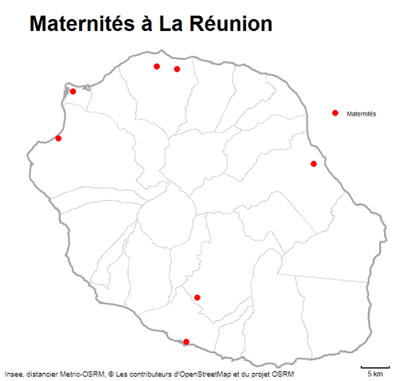
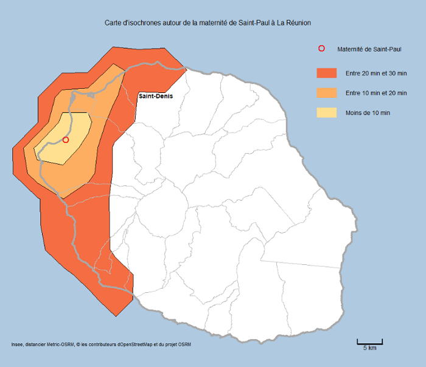
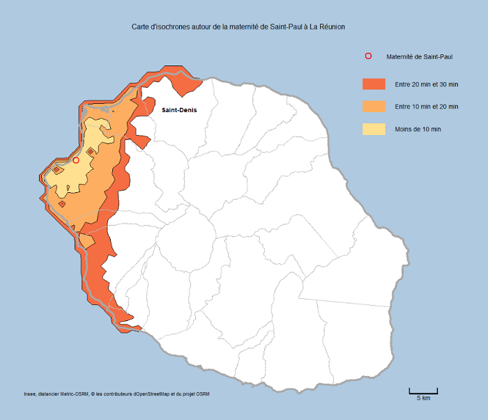
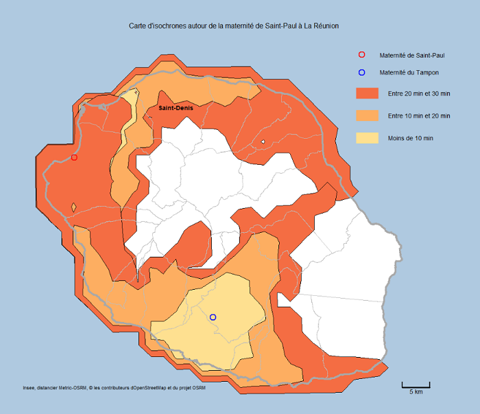
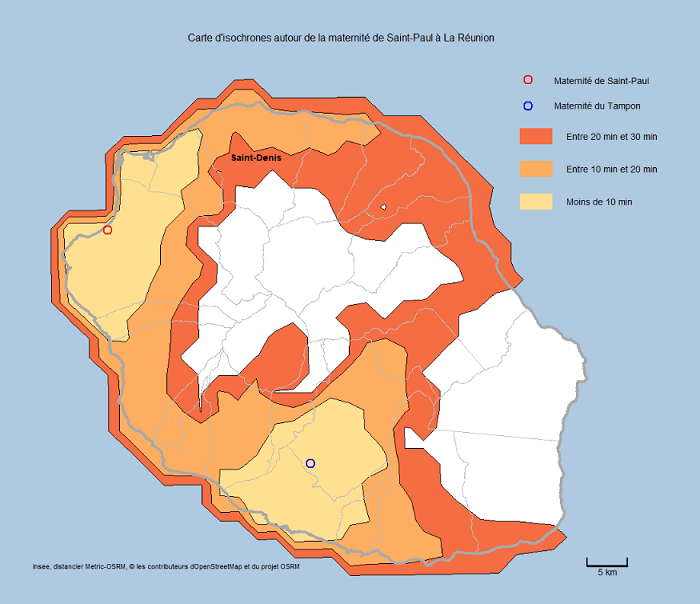
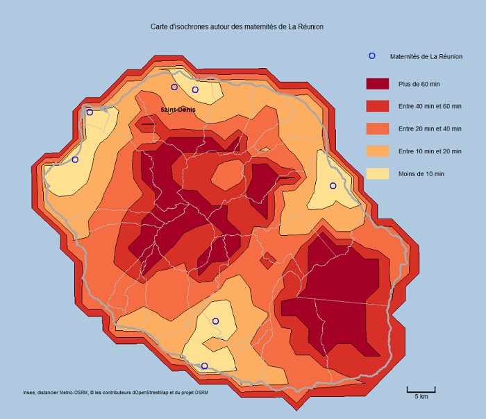
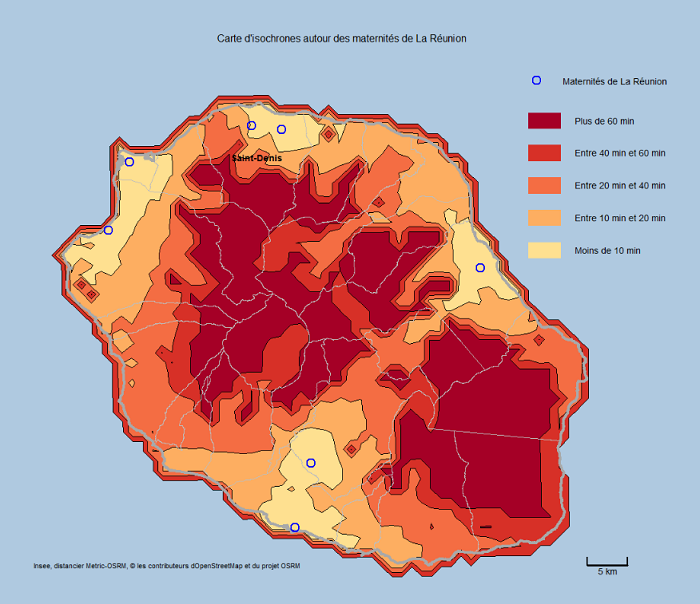
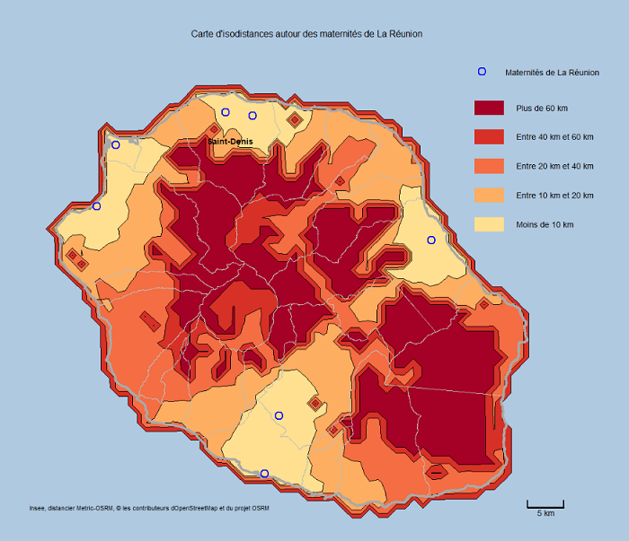

```{r, include = FALSE}
knitr::opts_chunk$set(
  collapse = TRUE,
  comment = "#>")

options(osrm.server = "https://metric-osrm-backend.lab.sspcloud.fr/")
options(osrm.profile = "driving")

library(metric.osrm)
```

Cet article détaille comment utiliser les fonctions `metricOsrmIso` et `indIsoSpatial` dans le but d'élaborer des cartes d'isochrones ou d'isodistances et de calculer quelques indicateurs spatiaux liés à ces derniers.

Le calcul d’isochrones et sa représentation permet de visualiser toutes les zones géographiques que l’on peut atteindre par la route depuis un point précis dans un (ou plusieurs) laps de temps en minutes. Pour les isodistances, le critère de calcul est la distance en kilomètres par la route.

Il s'agit là d'une logique différente de celle abordée pour les problématiques d'accès aux équipements (cf articles _Calculer une matrice de temps et de distances avec le package {metric.osrm}_ et _Calculer l'accès aux équipements les plus proches avec le package {metric.osrm}_). Nous avons ici un point de départ du trajet mais les destinations ne sont pas définies à l'avance par l'utilisateur.   

Pour illuster ce concept, prenons comme exemple une étude fictive sur l'accessibilité des maternités à La Réunion.

## Préparation des données

Nous disposons du fond communal de La Réunion et de la liste des maternités issue de la [Base Permanente des Équipements (BPE)](https://www.insee.fr/fr/statistiques/3568656).

A La Réunion, il y a 24 communes (géographie 2020) et 7 maternités recensées (BPE 2018) _(voir carte ci-dessous)_.

```{r}
# import du fond régional de La Réunion
reg04 <- sf::read_sf(dsn = system.file("extdata",
                                       "reg04.shp",
                                       package = "metric.osrm"),
                     stringsAsFactors = FALSE)

# import du fond communal de La Réunion
com_reg04 <- sf::read_sf(dsn = system.file("extdata",
                                           "com_reg04.shp",
                                           package = "metric.osrm"),
                         stringsAsFactors = FALSE)

# import de la liste des maternités de La Réunion issue de la BPE2018
bpe2018_maternites_reg04 <- readRDS(system.file("extdata",
                                                "bpe2018_maternites_reg04.RDS",
                                                package = "metric.osrm"))

# transformation des variables coordonnées en numérique
bpe2018_maternites_reg04$LAMBERT_X <- as.numeric(bpe2018_maternites_reg04$LAMBERT_X)
bpe2018_maternites_reg04$LAMBERT_Y <- as.numeric(bpe2018_maternites_reg04$LAMBERT_Y)
```



Le système de projection de La Réunion en vigueur est différent de la Métropole. Il s'agit du système de projection UTM40S du référentiel RGR92 et ayant pour code EPSG 2975.

Essayez :

```{r}
sf::st_crs(com_reg04)
```

Avant d'aller plus loin et d'utiliser d'autres fonctions du package, il est nécessaire de convertir ces coordonnées de maternités dans le système de projection WGS84 (EPSG 4326) avec la fonction `convertTo`.

```{r}
# Pour les data.frame, il faut spécifier le système de projection des coordonnées.
dt_maternites <- convertTo(from = bpe2018_maternites_reg04[,c("DEPCOM",
                                                              "LAMBERT_X",
                                                              "LAMBERT_Y")],
                           fromEpsg = 2975,
                           toEpsg = 4326)

dt_maternites
```

## Présentation de la fonction `metricOsrmIso`

Les calculs d'isochrones ou d'isodistances sont réalisés via la fonction `metricOsrmIso`.

Afin de gérer le cas d'une pluralité d'équipements (comme ici avec les maternités), la fonction permet de fournir des courbes autour de plusieurs points de départ.

Voyons en détail les différents arguments de la fonction `metricOsrmIso` :

- `loc` correspond à la localisation X Y des points de départ. Dans notre exemple, il s'agit des coordonnées des maternités. `loc` peut être un vecteur numérique (un point), un data.frame, un objet sf ou sp. S'il s'agit de polygones, leurs centroïdes seront utilisés ;

- `breaks` est une séquence de valeurs numériques indiquant des temps en minutes relatifs aux courbes isochrones ou des distances en kilomètres pour les courbes isodistances. En clair, ce sont les laps de temps ou les écarts de distances qui vous intéressent ; 

- `exclude` peut être utilisé si on souhaite que les trajets évitent les autoroutes ("motorway"), les péages ("toll") ou les ferries ("ferry"). Pour rappel, le serveur OSRM expérimental, déployé sur le SSPCloud, n'accepte qu'une exclusion à la fois ;

- `res` est une valeur numérique indiquant la 'résolution' des courbes isochrones ou isodistances, c'est-à-dire la précision de leurs contours. Calculer le parcours entre le point de départ et toutes les coordonnées du territoire d'étude n'est en effet guère envisageable. La fonction va donc diviser le territoire en une grille de points et les calculs se feront uniquement entre le départ du trajet et les points de la grille. Le paramètre `res` définit la finesse de cette grille.

- `returnClass` permet de choisir le format de sortie de l'objet spatial : "sf" (par défaut, MULTIPOLYGON) ou "sp" (SpatialPolygonDataFrame) ;

- `fusion` est un booléen (TRUE ou FALSE) qui indique si l'on souhaite fusionner les courbes isochrones de même valeur entre elles dans les cas où il y aurait plusieurs points de départ. Par défaut, `fusion = TRUE` ;

- `courbes` permet de choisir un mode de calcul pour obtenir des courbes d'`isochrones` (par défaut) ou d'`isodistances`.

## Usage

Voici un exemple d'utilisation de la fonction `metricOsrmIso` :

Nous voulons ici déterminer les territoires qui se situent à moins de 10, 20 et 30 minutes de temps de trajet (en voiture) de deux maternités précises de la Réunion. Nous choisissons de diviser notre territoire d'étude en une grille de 30 points de côté (soit 900 points) :

```{r}
# calcul d'isochrones autour de 2 maternités, Saint-Paul et du Tampon.
iso <- metricOsrmIso(loc = dt_maternites[c(5,7),],
                     breaks = c(10,20,30), # minutes
                     exclude = NULL,
                     res = 30,
                     returnclass = "sf",
                     fusion = FALSE,
                     courbes = "isochrones")

str(iso)
```

Dans la console, des barres de progression vous indiquent l'avancée du calcul.

```{r, eval = FALSE}
Etape 1/2 : calcul en cours de 188 couples -  [======================] 100%  2s
Etape 2/2 : formation de 2 isochrones -  [============================] 100%  1s
```

Plus le nombre de couples est élevé, plus le temps de calcul le sera également. Attention donc, en particulier, à la résolution que vous choisissez. Nous vous conseillons de tester plusieurs valeurs de résolution en commençant par une résolution basse puis en l'augmentant jusqu'à la valeur optimale. Plus les points de départ sont espacés, plus la résolution devra être élevée pour un rendu identique.

Ici, plus précisément, le temps de parcours a été calculé entre chacune de ces deux maternités et chacun des 94 points de la grille superposée au territoire de la Réunion. Avant la superposition avec l'île, la grille comportait 900 points (30 x 30).

Une fois ces temps calculés, la fonction regoupe tous les points à moins de 10, 20 et 30 minutes autour de chacune des maternités et constitue des territoires homogènes. Ces territoires homogènes seront les objets spatiaux en sortie de la fonction.

Nous avons délimité trois `breaks`(10, 20 et 30) et avons choisi `returnClass = "sf"` et `fusion = FALSE`. Nous aurons en sortie de la fonction une liste (ici appelée iso) contenant deux objets sf (car deux maternités) de trois polygones chacun, chaque polygone correspondant à un isochrone.

Si nous avions choisi `fusion = TRUE`, la liste contiendrait un seul objet sf de trois polygones.


## Cartographie

Voyons le résultat sur une carte. Nous ferons ensuite varier les paramètres de la fonction pour encore mieux comprendre leur fonctionnement.

Vous pouvez dorénavant exporter ces isochrones dans un format utilisable, par exemple par Qgis, via une commande du type :
```{r, eval = FALSE}
objetsf <- iso[[1]]

sf::st_write(objetsf, "macouche.shp", driver="ESRI Shapefile", delete_layer = T)
```

Pour connaître le répertoire de travail où le shp a été exporté, il suffit de lancer la commande `getwd()`. La commande `setwd("nouveau_chemin")` permet de modifier le répertoire de travail courant.

Pour visualiser rapidement la forme des isochrones, il est possible de faire :
```{r}
plot(sf::st_geometry(iso[[1]]))
```

Le 1er élément de la liste `iso` (`iso[[1]]`) correspond aux 3 isochrones autour de la maternité de Saint-Paul. `iso[[2]]` correspond aux 3 isochrones autour de la maternité du Tampon.

Pour réaliser des cartes plus élaborées avec des fonds d'habillage, des couleurs, une légende..., vous pouvez vous inspirer du script ci-dessous, qui n'est qu'une proposition de construction de carte à l'aide du package `oceanis` (voir [documentation](https://cran.r-project.org/web/packages/oceanis/)) et de plots successifs.

```{r, eval = FALSE}
# convertion en projection locale UTM40S (EPSG 2975)
# des isochrones autour de la maternité de Saint-Paul
iso1 <- convertTo(from = iso[[1]],
                  toEpsg = 2975)

# création de l'objet sf des maternités en projection locale UTM40S (EPSG 2975)
sf_maternite <- convertTo(from = dt_maternites,
                          fromEpsg = 4326,
                          to="sf",
                          toEpsg = 2975)

# on sélectionne une seule maternité pour l'instant,
# celle de Saint-Paul est la 5ème parmi les 7.
sf_maternite <- sf_maternite[5,]
sf_maternite$code <- c("97415")
sf_maternite <- sf_maternite[,c("id","code","geometry")]

# on récupère la bbox de La Réunion (les coordonnées du rectangle autour de La Réunion).
bbox <- sf::st_bbox(reg04)

# création d'un fond de mer à partir de la bbox. On élargi les limites du rectangle.
pol <- matrix(c(bbox$xmin-8000,bbox$ymin-8000,
                bbox$xmin-8000,bbox$ymax+13000,
                bbox$xmax+14000,bbox$ymax+13000,
                bbox$xmax+14000,bbox$ymin-8000,
                bbox$xmin-8000,bbox$ymin-8000),
              ncol=2,
              byrow=TRUE)

mer <- sf::st_sf(geometry = sf::st_sfc(sf::st_geometry(sf::st_polygon(list(pol))),
                                       crs=2975))

# En utilisant les fonctions plot_xxx du package oceanis,
# il est possible de personnaliser les fonds à représenter.
# Ici, nous allons utiliser la fonction plot_typo_symboles
# pour représenter les maternités sous forme de points.

# Pour personnaliser les fonds, on ajoute des colonnes à l'objet sf
# (COL, BORDER, EPAISSSEUR, FONT).

# personnalisation du fond de mer
mer$COL <- "#AFC9E0"
mer$BORDER <- "#AFC9E0"

# personnalisation des isochrones avec une palette de couleurs
iso1$COL <- oceanis::recup_palette(stylePalette = "defaut", nbNeg = 0, nbPos = 3)[[1]]

# personnalisation des fonds d'habillage
# pour gérer la superposition des couches sur la carte,
# on crée un 1er fond communal avec une couleur de fond qui sera sous les isochrones
com_reg04_fond <- com_reg04
com_reg04_fond$COL <- "white"
# puis un 2ème fond communal pour la couleur de la bordure qui sera au-dessus
# des isochrones
com_reg04_border <- com_reg04
com_reg04_border$BORDER <- "grey"

reg04$BORDER <- "darkgrey"
reg04$EPAISSEUR <- 4

# préparation des étiquettes : on écrit uniquement Saint-Denis comme étiquette 
etiquettes <- oceanis::coordonnees_etiquettes(fondMaille = com_reg04,
                                              listeCode = c("97411"))
etiquettes$FONT <- 2

# appel de la fonction plot_typo_symboles d'oceanis pour créer la carte de base
oceanis::plot_typo_symboles(fondPoints = sf_maternite,
                            # l'ordre des fonds est important : le 1er fond est dessous,
                            # le dernier au-dessus.
                            listFonds = list(mer,com_reg04_fond,iso1,
                                             com_reg04_border,reg04),
                            emprise = "974",
                            couleurs = "red", # couleur du point
                            types = 1, # type de point (voir graphics::pch)
                            tailles = 2, # taille du point
                            # position de la légende en coordonnées locales métriques
                            # (EPSG 2975). Il s'agit juste de la légende du point et non
                            # des classes de temps que nous ajouterons après.
                            xLeg = 372000,
                            yLeg = 7694000, 
                            titreCarte = "Carte d'isochrones autour de la maternité
                                          de Saint-Paul à La Réunion",
                            sourceCarte = "Insee, distancier Metric-OSRM, © les contributeurs d'OpenStreetMap et du projet OSRM",
                            etiquettes = etiquettes,
                            labels = c("Maternité de Saint-Paul"),
                            # limite de la carte à afficher
                            xlim = c(bbox$xmin-2000,bbox$xmax+2000),
                            ylim = c(bbox$ymin-2000,bbox$ymax+10000))

# Les étapes suivantes permettent juste d'ajouter une légende et une barre d'échelle
# avec des plot successifs, histoire de créer une carte complète.

# Ajout d'une légende de classes

# On crée 3 rectangles correspondant à chacune des classes d'isochrones
# (entre 0 et 10 min, entre 10 et 20 min et entre 20 et 30 min).
# Les valeurs ont été choisies de manière relative par rapport à la position de la légende
# du point, toujours en projection locale métrique (EPSG 2975)
rectangle1 <- matrix(c(371000,7690000,
                       371000,7688000,
                       375000,7688000,
                       375000,7690000,
                       371000,7690000),
                       # les 1er et dernier points sont identiques pour fermer le polygone
                     ncol=2, byrow=TRUE)
fond_leg_iso_20_30 <- sf::st_sf(geometry = sf::st_sfc(sf::st_polygon(list(rectangle1))),
                                crs=2975)

rectangle2 <- matrix(c(371000,7686000,
                       371000,7684000,
                       375000,7684000,
                       375000,7686000,
                       371000,7686000),
                     ncol=2, byrow=TRUE)
fond_leg_iso_10_20 <- sf::st_sf(geometry = sf::st_sfc(sf::st_polygon(list(rectangle2))),
                                crs=2975)

rectangle3 <- matrix(c(371000,7682000,
                       371000,7680000,
                       375000,7680000,
                       375000,7682000,
                       371000,7682000),
                     ncol=2, byrow=TRUE)
fond_leg_iso_0_10 <- sf::st_sf(geometry = sf::st_sfc(sf::st_polygon(list(rectangle3))),
                               crs=2975)

# on colorise les rectangles selon la même palette
# et on affiche les rectangles sur la carte
plot(sf::st_geometry(fond_leg_iso_20_30),
     col = rev(oceanis::recup_palette(stylePalette = "defaut",
                                      nbNeg = 0,
                                      nbPos = 3)[[1]])[1],
     border = "transparent",
     add = TRUE)
plot(sf::st_geometry(fond_leg_iso_10_20),
     col = rev(oceanis::recup_palette(stylePalette = "defaut",
                                      nbNeg = 0,
                                      nbPos = 3)[[1]])[2],
     border = "transparent",
     add = TRUE)
plot(sf::st_geometry(fond_leg_iso_0_10),
     col = rev(oceanis::recup_palette(stylePalette = "defaut",
                                      nbNeg = 0,
                                      nbPos = 3)[[1]])[3],
     border = "transparent",
     add = TRUE)

# on ajoute les labels de légende
text(376000, 7689000, labels = "Entre 20 min et 30 min", cex = 0.9, pos = 4)
text(376000, 7685000, labels = "Entre 10 min et 20 min", cex = 0.9, pos = 4)
text(376000, 7681000, labels = "Moins de 10 min", cex = 0.9, pos = 4)

# Placement d'une barre d'échelle

# on crée les lignes de la barre d'échelle
barre_echelle = sf::st_linestring(matrix(c(sf::st_bbox(reg04)$xmax,
                                           sf::st_bbox(reg04)$ymin,
                                           sf::st_bbox(reg04)$xmax+5000,
                                           sf::st_bbox(reg04)$ymin),
                                         ncol = 2,
                                         byrow=TRUE))
tick1_echelle = sf::st_linestring(matrix(c(sf::st_bbox(reg04)$xmax,
                                           sf::st_bbox(reg04)$ymin,
                                           sf::st_bbox(reg04)$xmax,
                                           sf::st_bbox(reg04)$ymin+1000),
                                         ncol = 2,
                                         byrow=TRUE))
tick2_echelle = sf::st_linestring(matrix(c(sf::st_bbox(reg04)$xmax+5000,
                                           sf::st_bbox(reg04)$ymin,
                                           sf::st_bbox(reg04)$xmax+5000,
                                           sf::st_bbox(reg04)$ymin+1000),
                                         ncol = 2,
                                         byrow=TRUE))

# on affiche la barre d'échelle
plot(barre_echelle, lwd = 3, add = T)
plot(tick1_echelle, lwd = 2, add = T)
plot(tick2_echelle, lwd = 2, add = T)

# on affiche la valeur de l'échelle
text(sf::st_bbox(reg04)$xmax+2500, sf::st_bbox(reg04)$ymin-700,labels="5 km",cex=0.9)

```



Certaines courbes isochrones empiètent sur la mer (ou plutôt l'océan à La Réunion). Cela est dû à la précision des courbes isochrones (résolution) et au lissage des points de la grille construite. L'empiètement serait réduit avec une résolution élevée.

La carte ci-dessous a été réalisée avec une résolution à 120 (28 800 couples) : `res = 120`.

```{r, eval = FALSE}
# calcul d'isochrones autour de la maternité de Saint-Paul.
iso <- metricOsrmIso(loc = dt_maternites[5,],
                     breaks = c(10,20,30), # minutes
                     exclude = NULL,
                     res = 120,
                     returnclass = "sf",
                     fusion = FALSE,
                     courbes = "isochrones")
```



Ajoutons maintenant une deuxième maternité (Le Tampon) et modifions les breaks : `breaks = c(20,40,60)`.

```{r, eval = FALSE}
# calcul d'isochrones autour de 2 maternités, Saint-Paul et du Tampon.
iso <- metricOsrmIso(loc = dt_maternites[c(5,7),],
                     breaks = c(20,40,60), # minutes
                     exclude = NULL,
                     res = 120,
                     returnclass = "sf",
                     fusion = FALSE,
                     courbes = "isochrones")
```



Sur cette carte, les polygones des isochrones autour de la maternité du Tampon cachent ceux autour de la maternité de Saint-Paul car ils se superposent. Avec le paramètre `fusion = FALSE`, nous avons en effet distingué les isochrones de chacune d'entre elles.

L'argument `fusion = TRUE` permet de fusionner les courbes isochrones par classes de temps de parcours et de régler ce problème. Ce qu'on représente change toutefois de nature ! Désormais, la carte témoigne du temps de parcours par la route en tout point de l'île, vers la maternité la plus proche parmi celles de Saint-Paul et du Tampon.

Avec `fusion = TRUE`, la liste retournée par la fonction `metricOsrmIso` ne contient qu'un seul objet sf au lieu de 2.

Pour un meilleur rendu, enlevons également les bordures noires.

```{r, eval = FALSE}
# calcul d'isochrones autour de 2 maternités, Saint-Paul et du Tampon.
iso <- metricOsrmIso(loc = dt_maternites[c(5,7),],
                     breaks = c(20,40,60), # minutes
                     exclude = NULL,
                     res = 120,
                     returnclass = "sf",
                     fusion = TRUE,
                     courbes = "isochrones")
```



Ajoutons maintenant toutes les maternités de La Réunion et la classe entre 0 et 10 minutes.

```{r, eval = FALSE}
# calcul d'isochrones autour de 2 maternités, Saint-Paul et du Tampon.
iso <- metricOsrmIso(loc = dt_maternites,
                     breaks = c(10,20,40,60), # minutes
                     exclude = NULL,
                     res = 120,
                     returnclass = "sf",
                     fusion = TRUE,
                     courbes = "isochrones")
```



La classe "Plus de 60 min" a été colorée en rouge foncé par différence entre le fond communal et les aires d'isochrones.

```{r, eval = FALSE}
# avant de représenter la carte, on personnalise les aires d'isochrones
# avec une palette de 4 couleurs
iso1$COL <- recup_palette(stylePalette = "defaut", nbNeg = 0, nbPos = 5)[[1]][1:4]
# on ajoute la 5ème couleur (plus foncée) au fond communal qui créera la différence.
# Elle était blanche auparavant.
com_reg04_fond$COL <- recup_palette(stylePalette = "defaut", nbNeg = 0, nbPos = 5)[[1]][5]
```

La fonction `metricOsrmIso` ne retourne toutefois pas de polygone pour les temps supérieurs au max des breaks, ici à plus de 60 minutes.

L'élaboration de cette carte a nécessité le calcul de 100 800 couples vers le serveur OSRM et a mis moins de 7 minutes pour être réalisée.

Si on augmente encore la résolution, on pourrait avoir une carte encore plus précise des contours isochrones, mais le nombre de requêtes et le temps de calcul seront aussi beaucoup plus élevés.

La carte suivante a nécessité le calcul de 403 200 couples (`res = 240`) pour un temps de traitement de moins de 30 minutes.

```{r, eval = FALSE}
# calcul d'isochrones autour de 2 maternités, Saint-Paul et du Tampon.
iso <- metricOsrmIso(loc = dt_maternites,
                     breaks = c(10,20,40,60), # minutes
                     exclude = NULL,
                     res = 240,
                     returnclass = "sf",
                     fusion = TRUE,
                     courbes = "isochrones")
```



Pour finir, on peut s'amuser à comparer cette dernière carte à celle des isodistances (`courbes = "isodistances"`).

```{r, eval = FALSE}
# calcul d'isochrones autour de 2 maternités, Saint-Paul et du Tampon.
iso <- metricOsrmIso(loc = dt_maternites,
                     breaks = c(10,20,40,60), # kilomètres
                     exclude = NULL,
                     res = 240,
                     returnclass = "sf",
                     fusion = TRUE,
                     courbes = "isodistances")
```



## Calculs d'indicateurs spatiaux

Pour aller plus loin sur l'exploitation des isochrones (ou isodistances), il peut être intéressant d'intersecter des courbes iso avec une maille pour connaître la répartition d'une variable en volume (par exemple la population) à l'intérieur des aires d'iso. La maille peut être de différente nature : une grille carroyée ou un fond communal par exemple.

La fonction `indIsoSpatial` permet d'agréger des variables en volume selon leur appartenance à une zone géographique, ici des aires d'isochrones ou d'isodistances. Pour notre étude sur l'accessibilité des maternités à La Réunion, nous pourrons ainsi estimer le nombre de personnes situées à moins de 10, 20 ou 30 minutes en voiture d'une maternité.

Il est possible de préciser une variable de pondération pour ces valeurs en volume.

L'intersection de la maille (une commune, un carreau) avec les courbes iso est rarement parfaite. Si mon carreau est, par exemple, coupé en deux par la courbe iso, comment sera considérée sa variable en volume ? Je l'exclus du calcul ? Je le garde et avec lui la population du carreau en entier ? J'en prends une partie seulement mais alors comment diviser la population de mon carreau ?  

La fonction `indIsoSpatial` offre par conséquent trois possibilités de traitement :

- soit on conserve la totalité du volume de l'entité de la maille ;

- soit on proratise le volume en fonction de la surface du polygone inclus dans l'isochrone ou l'isodistance ;

- soit on exclut la totalité du volume de l'entité de la maille.

#### Présentation de la fonction `indIsoSpatial`

La fonction `indIsoSpatial` prend comme arguments :

- `pol` est un objet sf (POLYGON ou MULTIPOLYGON) ou sp (SpatialPolygons ou SpatialPolygonsDataFrame). Il peut s'agir de courbes isochrones ou isodistances ;

- `maille` est également un objet sf (POLYGON ou MULTIPOLYGON) ou sp (SpatialPolygons ou SpatialPolygonsDataFrame). Il s'agit de la maille que l'on souhaite intersecter par `pol` ;

- `var` est un vecteur contenant les noms des variables en volume à sommer présents dans l'objet `maille` ;

- `pond` est un vecteur contenant les noms des variables de pondération présents dans l'objet `maille`. Si `pond` est spécifié, l'ordre des variables de pondération doit correspondre à celui des variables à sommer renseignées dans `var`;

- `choixIntersect` est une valeur numérique : 1 (conservation du volume), 2 (proratisation du volume en fonction de la surface d'intersection) ou 3 (exclusion du volume) ;

- `return` est un vecteur caractère : "pol", "maille" ou c("pol","maille"). Si "pol", la fonction retourne l'objet `pol` enrichi des variables en volume de l'objet `maille` agrégées par polygone. Si "maille", la fonction retourne l'objet `maille` enrichi d'une variable indiquant le groupe d'appartenance de chaque entité de la maille à `pol` et d'une variable avec le total du volume agrégé pour chaque groupe ;

- `idGroup` est un vecteur caractère contenant le nom de la variable identifiant les `pol`. Il doit être spécifié, si `return` contient `maille`, pour constituer les groupes d'appartenance des entités de la maille.

#### Usage

Pour notre étude, nous voulons connaître la part de la population réunionnaise située à moins de 10, 20 et 30 minutes d'une maternité par la route en voiture.

Nous disposons de la grille carroyée à 200 mètres de La Réunion avec les données de la population par carreau. Cette grille, issue du dispositif [Filosofi 2015](https://www.insee.fr/fr/statistiques/4176290?sommaire=4176305), est disponible sur insee.fr.

```{r}
# import d'une grille carroyée
grille200m_974 <- readRDS(system.file("extdata",
                          "Filosofi2015_carreaux_200m_reg04.RDS",
                          package = "metric.osrm"))

# calcul d'isochrones autour de toutes les maternités de La Réunion.
iso <- metricOsrmIso(loc = dt_maternites,
                     breaks = c(10,20,30),
                     exclude = NULL,
                     res = 60,
                     returnclass = "sf",
                     fusion = TRUE,
                     courbes = "isochrones")

# calcul de l'indicateur spatial par intersection des courbes isochrones et de la grille.
ind <- indIsoSpatial(pol = iso[[1]],
                     maille = grille200m_974,
                     var = c("Ind"),
                     pond = NULL,
                     choixIntersect = 2,
                     return = c("pol","maille"),
                     idGroup = "id")

head(ind[[1]])
```
```{r}
head(ind[[2]])
```

Le résultat de la fonction `indIsoSpatial` est un objet sf si `return = "pol" ou "maille"`, une liste de deux objets sf si `return = c("pol","maille")`.

L'objet pol (`ind[[1]]`) est enrichi de la variable en volume `Ind` agrégée selon les aires d'isochrones ou d'isodistances.

L'objet maille (`ind[[2]]`) a été enrichi de deux variables : `groupe_pol` indiquant l'identifiant de `pol` et `sum_pop` la somme de la variable dans le groupe.

Le fait de spécifier `choixIntersect = 2` permet de conserver la population uniquement incluse dans une aire d'isochrones ou d'isodistances. Avec ce choix, les temps de calcul seront plus longs qu'avec les choix 1 ou 3 car un géo-traitement  supplémentaire doit être effectué (intersection). Néanmoins, il faut savoir qu'avec le choix 1, le volume du carreau à cheval sera affecté à 2 zones iso. Il y aura donc double compte lors de la sommation totale des volumes par zone iso. Avec le choix 3, c'est l'inverse, le volume n'est pas du tout comptabilisé.

La précision du résultat pour l'indicateur spatial (choix 1, 2 ou 3) doit être en adéquation avec la résolution retenue. Une résolution basse (contour grossier) ne justifie pas d'effectuer une estimation précise de la population par intersection des courbes et des carreaux (choix 2).

Pour vous aider à mesurer ce degré de précision et trouver un compromis, rappelons le fait que l'apparence des contours selon la valeur de la résolution est fonction du nombre de points de départ et de leur repartition géographique. Par exemple, pour une même résolution de 60, si 2 points de départ sont distants de 1 km, le rendu sera meilleur que si les 2 points étaient distants de 10 km. Aussi, la résolution et le rendu des contours n'a aucun rapport avec celle de votre objet statistique (ici une grille à 200 mètres). Vous avez déjà réalisé en amont le choix de l'objet statistique à utiliser (grille, maille...) et vous connaissez donc son degré de précision. En choisissant une grille à 1 km, les courbes seront strictement les mêmes, seules les valeurs de l'indicateur spatial seront différentes.

Enfin, la commande était de connaître la part de la population située à moins de 10, 20 et 30 minutes d'une maternité à La Réunion par la route en voiture :

```{r}
# calcul de la population totale de La Réunion à partir de la somme de pop
# de tous les carreaux
pop_tot <- sum(grille200m_974$Ind, na.rm = TRUE)

# calcul de la part de la population à moins de 10, 20 et 30 minutes
# d'une maternité à La Réunion
part <- lapply(1:nrow(ind[[1]]), function(x) as.data.frame(ind[[1]])[x,"Ind"]/pop_tot*100)

part
```

- 35.2 % de la population réunionnaise habite à moins de 10 minutes d'une maternité ;
- 79.4 % de la population réunionnaise habite à moins de 20 minutes d'une maternité, dont 42 % entre 10 et 20 minutes ;
- 96.4 % de la population réunionnaise habite à moins de 30 minutes d'une maternité, dont 12.2 % entre 20 et 30 minutes ;
- 3.6 % de la population réunionnaise habite à plus de 30 minutes d'une maternité.
