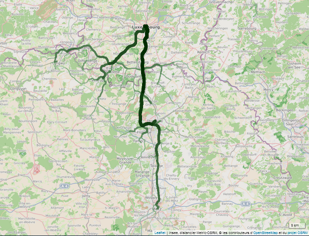

```{r, include = FALSE}
knitr::opts_chunk$set(
  collapse = TRUE,
  comment = "#>")

options(osrm.server = "https://metric-osrm-backend.lab.sspcloud.fr/")
options(osrm.profile = "driving")

library(dplyr)
library(metric.osrm)
```

Cet article détaille comment visualiser sur une carte le ou les trajets effectivement empruntés par la route après requêtage du serveur de calcul OSRM.

L'intérêt principal d'une telle carte est qu'elle permet, par superposition des trajets ou en jouant sur la largeur des routes, de représenter la densité de passage sur le réseau routier et donc de mettre en évidence les axes les plus empruntés (routes, carrefours...). Cette carte apporte ainsi un complément d'information aux cartes en oursins ou en flèches joignantes (flèches proportionnelles) utilisées classiquement dans les études de flux comme les déplacements domicile-travail. 

Pour ce faire, la fonction `metricOsrmRoute` du package `metric.osrm` permet tout d'abord de récupérer la géométrie des trajets. Puis deux fonctions au choix permettent leur visualisation sur une carte : `mapRoutes` et `mapRoutesProp`.

## Présentation de la fonction `metricOsrmRoute`

La fonction `metricOsrmRoute` permet d'obtenir un tracé de route (ou géométrie). Il s'agit d'une ligne brisée. Les extrémités des segments (ou noeuds) sont géolocalisées par des coordonnées lon/lat du système de projection WGS84 (EPSG 4326).

Un tracé est toujours calculé entre deux points : une source (point de départ) et une destination (point d'arrivée). Il est possible d'ajouter des points intermédiaires que le tracé devra obligatoirement emprunter constituant ainsi un itinéraire. Par ailleurs, il est également possible d'utiliser la source comme destination finale afin de former une boucle.

Les arguments de la fonction `metricOsrmRoute` sont :

- `src`, le point de départ. Il s'agit d'un vecteur, data.frame (1 ligne), objet sf (1 ligne) ou sp (SpatialPointsDataFrame ou SpatialPolygonsDataFrame d'une entité). S'il s'agit d'un polygone, son centroïde sera utilisé ;

- `dst`, le point d'arrivée. Il s'agit d'un vecteur, data.frame (1 ligne), objet sf (1 ligne) ou sp (SpatialPointsDataFrame ou SpatialPolygonsDataFrame d'une entité). S'il s'agit d'un polygone, son centroïde sera utilisé ;

- `loc`, les points de départ, intermédiaires et d'arrivée. Il s'agit d'un data.frame, objet sf ou sp (SpatialPointsDataFrame ou SpatialPolygonsDataFrame). S'il s'agit de polygones, les centroïdes seront utilisés.

Si `loc` est spécifié alors `src` et `dst` sont ignorés. `loc` doit contenir, dans l'ordre de passage, tous les points que doit emprunter le tracé (point de départ, point intermédiaire 1, point intermédiaire 2, ..., point intermédiaire n-1 et point d'arrivée).

- `overview` indique la précision du tracé. Les modalités sont "simplified" (par défaut) pour un tracé simplifié, "full" pour un tracé détaillé ou "NULL" pour qu'aucune géométrie ne soit renvoyée (renvoie seulement le temps et la distance).

Les tracés simplifiés avec `overview = "simplified"` ne se juxtaposent pas exactement au réseau routier mais présentent l'avantage d'être plus rapide à être calculés.

Les tracés détaillés avec `overview = "full"` sont utiles pour des représentations précises des tracés sur une carte. Nous verrons plus loin dans cet article, que ce choix est obligatoire pour l'utilisation de la fonction `mapRoutesProp`. Toutefois, les temps de calcul sont plus longs qu'en mode simplifié.

- `exclude` peut être utilisé pour éviter les autoroutes ("motorway"), les péages ("toll") ou les ferries ("ferry"). Pour rappel, le serveur OSRM expérimental, déployé sur le SSPCloud, n'accepte qu'une exclusion à la fois ;

- `returnclass` permet de choisir le format de sortie entre un objet sf ("sf"), sp ("sp") ou un data.frame de coordonnées ("NULL" par défaut).

Le choix `returnclass = NULL` est intéressant si `overview = "full"` car les temps de calcul seront alors réduits par rapport aux choix `returnclass = "sf" ou "sp"`.

Pour l'exemple, nous allons demander au serveur de calcul OSRM de nous renvoyer le tracé de route entre Marseille (lon=5.37437, lat=43.29533) et Montpellier (lon=3.87915, lat=43.60852).

```{r}
# calcul du tracé de route entre Marseille et Montpellier
route <- metricOsrmRoute(src = c(5.37437,43.29533),
                         dst = c(3.87915,43.60852),
                         overview = "simplified",
                         exclude = NULL,
                         returnclass = "sf")

route
```

La fonction renvoie bien un objet sf comme demandé par `returnclass = "sf"`. La durée et la distance du trajet en voiture ont été calculées.

## Présentation de la fonction `mapRoutes`

Pour visualiser le tracé de route, il est possible d'utiliser la fonction `mapRoutes`. Elle prend comme arguments :

- `res` une liste d'objets sf (LINESTRING ou MULTILINESTRING) ou sp (LINES), résultat de la fonction `metricOsrmRoute` mis dans une liste.

Pour visualiser plusieurs tracés, il faut réexecuter la fonction `metricOsrmRoute` autant de fois que de tracés à calculer et incrémenter une liste pour chaque résultat.

- `fonds` une liste d'objets sp ou sf permettant d'ajouter des fonds supplémentaires à la carte ;

- `opaciteOSM` une valeur numérique entre 0 et 1 définissant l'opacité du fond OpenStreetMap. 1 : aucune transparence, 0 : totalement transparent.

Pour choisir une couleur et une épaisseur, il faut ajouter des colonnes `col` et `classes` aux objets sf ou sp. Nous détaillerons cette fonctionnalité plus loin dans l'article.

```{r, eval = FALSE}
# import d'un fond départemental
fond_dep_13_30_34 <- sf::read_sf(dsn = system.file("extdata",
                                                   "fond_dep_13_30_34.shp",
                                                   package = "metric.osrm"),
                     stringsAsFactors = FALSE)

# personnalisation du tracé
route$col <- "red"
route$classes <- 5

# visualisation du tracé de route entre Marseille et Montpellier
map <- mapRoutes(res = list(route),
                 fonds = list(fond_dep_13_30_34),
                 opaciteOSM = 0.6)

map
```


Utilisons maintenant le paramètre `loc` à la place de `src` et `dst`. Nous voulons que le tracé passe par Martigues (lon=5.03642, lat=43.40898) et Saint-Gilles (lon=4.42964, lat=43.67712) et ceci sans emprunter d'autoroute.

```{r, eval = FALSE}
# calcul du tracé de route entre Marseille et Montpellier via Martigues et Saint-Gilles
# sans autotroute
loc = data.frame(id = c("Marseille","Martigues","Saint-Gilles","Montpellier"),
                 lon = c(5.37437,5.03642,4.42964,3.87915),
                 lat = c(43.29533,43.40898,43.67712,43.60852),
                 stringsAsFactors = FALSE)

itineraire <- metricOsrmRoute(loc = loc,
                              overview = "simplified",
                              exclude = "motorway",
                              returnclass = "sf")

itineraire$col <- "blue"
itineraire$classes <- 5

map <- mapRoutes(res = list(route, itineraire),
                 fonds = list(fond_dep_13_30_34),
                 opaciteOSM = 0.6)

map
```


En zoomant, nous pouvons constater que par endroit les deux tracés ne se superposent pas du fait de la représentation simplifiée des routes. Pour éviter cela, passons à une représentation détaillée avec `overview = "full"`.

```{r, eval = FALSE}
route <- metricOsrmRoute(src = c(5.37437,43.29533),
                         dst = c(3.87915,43.60852),
                         overview = "full",
                         exclude = NULL,
                         returnclass = "sf")

itineraire <- metricOsrmRoute(loc = loc,
                              overview = "full",
                              exclude = "motorway",
                              returnclass = "sf")

route$col <- "red"
route$classes <- 5
itineraire$col <- "blue"
itineraire$classes <- 5

map <- mapRoutes(res = list(route, itineraire),
                 fonds = list(fond_dep_13_30_34),
                 opaciteOSM = 0.6)

map
```


Comparons un même tracé avec l'argument `returnclass = NULL`. La fonction `metricOsrmRoute` retournera alors un data.frame de coordonnées.

```{r}
route_simplifiee <- metricOsrmRoute(src = c(5.37437,43.29533),
                                    dst = c(3.87915,43.60852),
                                    overview = "simplified",
                                    exclude = NULL,
                                    returnclass = NULL)

str(route_simplifiee)
```
```{r}
route_detaillee <- metricOsrmRoute(src = c(5.37437,43.29533),
                                   dst = c(3.87915,43.60852),
                                   overview = "full",
                                   exclude = NULL,
                                   returnclass = NULL)

str(route_detaillee)
```
La route simplifiée contient 34 noeuds sur le tracé (ou 33 segments de routes) alors que la route détaillée contient 2 140 noeuds (ou 2 139 segments de routes). Pour un grand nombre de routes à représenter, le calcul sera évidemment beaucoup plus long avec le choix `overview = "full"`.

## Présentation de la fonction `mapRoutesProp`

La fonction `mapRoutesProp` permet la visualisation des tracés des routes en représentant une information supplémentaire : le nombre de passages par tronçon de route en jouant sur sa largeur.

Tout comme la fonction `mapRoutes`, elle utilise le résultat de la fonction `metricOsrmRoute`.

Pour que cette fonction ait une réelle utilité, il faut disposer de plusieurs tracés de routes empruntant le même réseau routier.

Le vocabulaire est important :

- un __tracé__ est une ligne reliant un point A à un point B (ou B vers A) par la route ;

- un __trajet__ est une navette. Il peut exister plusieurs trajets pour un tracé. Par exemple, un aller-retour correspond à 2 trajets pour un seul tracé ;

- un __tronçon__ est une partie d'un tracé emprunté par un ou plusieurs navetteurs.

Les arguments de la fonction `mapRoutesProp` sont :

- `res` une liste d'objets sf (LINESTRING ou MULTILINESTRING) ou sp (LINES), résultat de la fonction `metricOsrmRoute` mis dans une liste ;

- `fonds` une liste d'objets sp ou sf permettant d'ajouter des fonds supplémentaires à la carte ;

- `nbLargeurs` une valeur numérique précisant le nombre de largeurs différentes à représenter, par défaut `nbLargeurs = 5` ;

- `nbFlux` un vecteur numérique correspondant au nombre de trajets par tracé. Par défaut, `nbFlux = 1`.

Chaque tracé de route est découpé par tronçon. On additionne ensuite le volume du flux (ou nombre de trajets) pour tous les tronçons communs à plusieurs tracés. Avec `nbFlux = 1`, il n'y a qu'un trajet par tracé.

- `opaciteOSM` une valeur numérique entre 0 et 1 définissant l'opacité du fond OpenStreetMap. 1 : aucune transparence, 0 : totalement transparent.

Dans la suite de cet article, afin d'illustrer l'utilisation la fonction `mapRoutesProp`, prenons l'exemple d'une étude fictive sur les déplacements domicile - travail de résidents français travaillant au Luxembourg.

Pour ce faire, nous disposons de la base 2016 sur les flux de mobilité des « déplacements domicile-travail » en géographie des communes de 2019. Cette base France métropolitaine + DOM est disponible via [ce lien](https://www.insee.fr/fr/statistiques/4171554) sur insee.fr.

Le champ de notre étude est restreint aux déplacements des résidents français des départements de Moselle et Meurthe-et-Moselle travaillant au Luxembourg.  

Les déplacements se feront ici de commune à commune à partir des chefs-lieux pour les communes françaises et des centroïdes pour les communes luxembourgeoises. Idéalement, il faudrait disposer de coordonnées plus précises, surtout si l'emprise de l'étude est infra-communale. Pour notre étude, d'emprise supra-communale, nous nous contenterons des chefs-lieux ou des centroïdes de communes.

A noter que notre base sur les flux de mobilité ne fait pas de distinction entre modes de transport. Pour en disposer (la modalité Vélo a été ajoutée à partir du RP 2017 par exemple), il faudrait requêter les fichiers du RP de l'Entrepôt des Données Locales (EDL). Dans cet exemple, nous considérerons, pour faire simple, que tous les trajets s'effectuent en voiture.

Enfin, pour des raisons de volumétrie, seuls les couples de communes dont le flux de navetteurs est supérieur à 100 sont retenus.

```{r}
# import des fonds et des données

com_dep_54_57 <- sf::read_sf(dsn = system.file("extdata",
                                               "com_dep_54_57.shp",
                                               package = "metric.osrm"),
                     stringsAsFactors = FALSE)

chx_dep_54_57 <- codeComToCoord(codeInsee = com_dep_54_57$code,
                                geo = "2019",
                                type = "chx")

com_lux <- sf::read_sf(dsn = system.file("extdata",
                                         "com_lux.shp",
                                         package = "metric.osrm"),
                     stringsAsFactors = FALSE)

deplacements_DT_FR_LUX <- readRDS(system.file("extdata",
                                              "deplacements_DT_FR_LUX.RDS",
                                              package = "metric.osrm"))

# calcul des tracés de routes.
# on boucle sur le nombre de couples de déplacements.
# res_routes est une liste.
res_routes <- lapply(1:nrow(deplacements_DT_FR_LUX), function(x){
                      metricOsrmRoute(
                        src = chx_dep_54_57[chx_dep_54_57$code ==
                                              deplacements_DT_FR_LUX[x,"CODGEO"],],
                        dst = com_lux[com_lux$id ==
                                        deplacements_DT_FR_LUX[x,"DCLT"],],
                        overview = "full",
                        exclude = NULL,
                        returnclass = NULL)
})

res_routes_prop <- mapRoutesProp(res = res_routes,
                                 nbLargeurs = 10,
                                 nbFlux = deplacements_DT_FR_LUX$NBFLUX_C16,
                                 opaciteOSM = 0.6)
```
```{r, eval = FALSE}
res_routes_prop[[1]]
```


En sortie, la fonction `mapRoutesProp` retourne une liste de deux objets.

Le premier est un objet leaflet qui peut être affiché directement dans le Viewer de RStudio avec le style par défaut imposé par la fonction, hormis le nombre de largeurs différentes et l'opacité du fond OSM.

Le deuxième est un objet sf constitué de tous les tronçons de routes, constituant ainsi tous les tracés. En plus de la géométrie, l'objet contient :

- une colonne `weight` (ou poids) qui indique le nombre de trajets par tronçon de route ;

- une colonne `classes` définissant la largeur des lignes à l'affichage, de 1 à n où n est le nombre de largeurs différentes, spécifié par `nbLargeurs` ;

- une colonne `col` qui précise la couleur des lignes. Par défaut, la colonne est remplie avec "#002C00" (vert foncé) ;

- une colonne `idTrace` qui donne les identifiants des tracés par tronçon de route. Un tronçon peut être emprunté par plusieurs tracés.

```{r}
length(unique(res_routes_prop[[2]]$weight))
```
```{r}
as.data.frame(res_routes_prop[[2]])[res_routes_prop[[2]]$classes == 10,
                                    c("classes","weight")]
```

Il y a 192 tronçons de routes de poids différents. Il y a 8 tronçons de route de classe 10 dont le nombre de trajets est supérieur à 20 000.

Attention car la somme de tous les poids n'est pas égale au nombre total de trajets. Par exemple, si deux trajets A->D et B->D se rejoignent à un point C, alors il y aura 3 tronçons : 2 tronçons de poids 1 (A->C et B->C) et un tronçon de poids 2 (C->D). Pour ces 2 trajets, la somme des poids fait 4. Le tronçon commun C->D n'est compté qu'une seule fois.


Les identifiants des tracés (colonne `idTrace`) peuvent nous aider à personnaliser les lignes. Cela peut être utile pour faire ressortir des routes particulières sur la carte. Comme il peut y avoir plusieurs identifiants de tracés par tronçon, ils sont notés par exemple de cette façon : `1-2-3-0`. Les identifiants sont séparés par des `-` et le dernier vaut 0 (à ignorer).


Il est possible de changer la couleur des lignes en modifiant les valeurs dans la colonne `col`. Cela peut être utile pour mettre en valeur des grappes de tracés ou visualiser les classes.

```{r}
# avec un dégradé de vert
res_routes_prop[[2]][res_routes_prop[[2]]$classes == 1, "col"] <- "#90BC90"
res_routes_prop[[2]][res_routes_prop[[2]]$classes == 2, "col"] <- "#80AC80"
res_routes_prop[[2]][res_routes_prop[[2]]$classes == 3, "col"] <- "#709C70"
res_routes_prop[[2]][res_routes_prop[[2]]$classes == 4, "col"] <- "#608C60"
res_routes_prop[[2]][res_routes_prop[[2]]$classes == 5, "col"] <- "#507C50"
res_routes_prop[[2]][res_routes_prop[[2]]$classes == 6, "col"] <- "#406C40"
res_routes_prop[[2]][res_routes_prop[[2]]$classes == 7, "col"] <- "#305C30"
res_routes_prop[[2]][res_routes_prop[[2]]$classes == 8, "col"] <- "#204C20"
res_routes_prop[[2]][res_routes_prop[[2]]$classes == 9, "col"] <- "#103C10"
res_routes_prop[[2]][res_routes_prop[[2]]$classes == 10, "col"] <- "#002C00"
```

Il est également possible de modifier les largeurs de route (colonne `classes`). Par défaut, les valeurs vont de 1 à n où n = `nbLargeurs`.

Pour supprimer des tronçons sur la carte, il suffit de supprimer des lignes du tableau selon le critère de votre choix. Par exemple, `weight >= 1000`.

Pour visualiser les modifications, il faut lancer de nouveau la fonction `mapRoutes`.

```{r, eval = FALSE}
map <- mapRoutes(res = list(res_routes_prop[[2]]),
                 opaciteOSM = 0.6)

map
```


